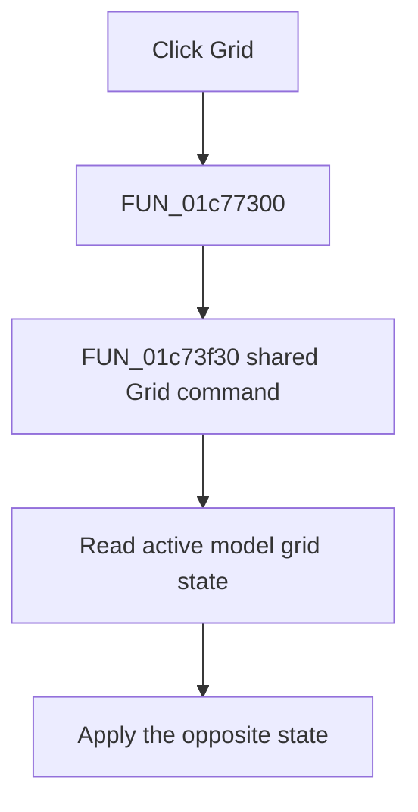

# &Grid

> Analysis status: Complete. The shared Grid toolbar handler proves the state toggle.

## Control

| Property | Recovered value |
| --- | --- |
| Form | SchematicEditor |
| Component path | SchematicEditor.MainMenu.View.mnGrid |
| Control class | TMenuItem |
| Caption | &Grid |
| Hint | Not present in the recovered resource. |
| Text | Not present in the recovered resource. |
| Handler name | mnGridClick |
| Handler address | 01c77300 |
| Graph node | `resource:dfm:SchematicEditor/SchematicEditor.MainMenu.View.mnGrid` |
| Handler node | `function:01c77300` |
| Graph layer | UI |

## What happens when clicked

`FUN_01c77300` delegates to `FUN_01c73f30`. The helper reads the active schematic model's grid state with `FUN_01995280` and passes the opposite value to `FUN_01995220`. The `ToolGrid` toolbar control uses the same helper and has the recovered hint `Grid On/Off|Turns the grid on or off in schematic editor`. Thus, the menu item and toolbar button are two entry points for the same grid toggle.

## Click flow

## Handler evidence

- Source: [DecompiledSources/Tina16/functions/0000000001C77300__FUN_01c77300.c](../../../DecompiledSources/Tina16/functions/0000000001C77300__FUN_01c77300.c)
- Recovered role: Toggles the grid state of the active schematic model.
- Current graph summary: Handles 1 Delphi UI event: SchematicEditor.MainMenu.View.mnGrid.OnClick.
- Current graph behavior: Calls the shared Grid command, which reads and inverts the active schematic model's grid state.
- Current graph evidence: The menu wrapper calls `FUN_01c73f30`. `SchematicEditor.TopToolBar.EditorTools.ToolGrid` uses the same helper, and its DFM hint states that it turns the schematic-editor grid on or off. The helper reads the state with `FUN_01995280` and writes its inverse with `FUN_01995220`.
- Complexity: simple
- Distinct outgoing calls: 1

## Direct calls

- `function:01c73f30` — Handles 1 Delphi UI event: SchematicEditor.TopToolBar.EditorTools.ToolGrid.OnClick.

## Resource evidence

- Kind: Not present in the recovered resource.
- Modal result: Not present in the recovered resource.
- Checked state: true
- List items: Not present in the recovered resource.
- Image reference: Not present in the recovered resource.
- Extracted glyph: None.

## Nearby label candidates

Nearby labels are layout candidates only. They are not proof of behavior.

- No same-parent label candidate is available.

## Analysis limits

- The recovered model field has no Delphi name. The shared toolbar resource and the helper's read-invert-write sequence establish the grid behavior.

