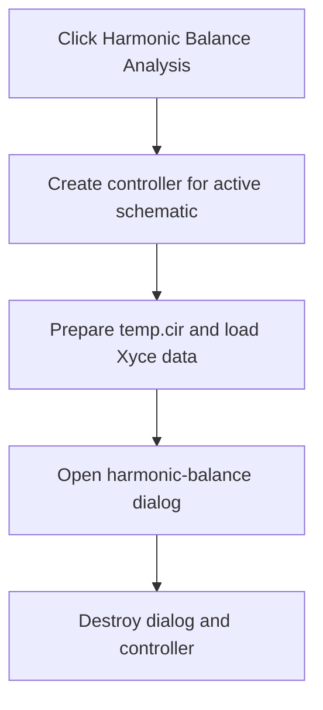

# Harmonic Balance Analysis...

> Analysis status: Reviewed from the harmonic-balance controller and dialog paths.

## Control

| Property | Recovered value |
| --- | --- |
| Form | SchematicEditor |
| Component path | SchematicEditor.MainMenu.mnAnalysis.mnHBAnalysis |
| Control class | TMenuItem |
| Caption | Harmonic Balance Analysis... |
| Hint | Not present in the recovered resource. |
| Text | Not present in the recovered resource. |
| Handler name | mnHarmonicBalanceDiscreteClick |
| Handler address | 01ca4df0 |
| Graph node | `resource:dfm:SchematicEditor/SchematicEditor.MainMenu.mnAnalysis.mnHBAnalysis` |
| Handler node | `function:01ca4df0` |
| Graph layer | UI |

## What happens when clicked

The handler creates a harmonic-balance controller for the active schematic. The controller prepares a `temp.cir` input and uses the Xyce simulator path to load the harmonic-balance data. The handler then opens `HBAnalysisDlgDiscrete`, gives it the controller and result list, and waits for the dialog. The dialog lets the user set the base frequency, harmonic count, and output before calculation or drawing. The handler destroys the dialog and controller after it closes.

## Click flow

## Handler evidence

- Source: [DecompiledSources/Tina16/functions/0000000001CA4DF0__FUN_01ca4df0.c](../../../DecompiledSources/Tina16/functions/0000000001CA4DF0__FUN_01ca4df0.c)
- Recovered role: Prepare and show the discrete harmonic-balance analysis dialog.
- Current graph summary: Handles 1 Delphi UI event: SchematicEditor.MainMenu.mnAnalysis.mnHBAnalysis.OnClick.
- Current graph behavior: Builds harmonic-balance input for the active schematic, loads simulation data, and opens the result and setup dialog.
- Current graph evidence: `FUN_01ca4df0` gets the active schematic through `FUN_019a4600`, constructs the controller through `FUN_01b4c3a0`, and prepares it through `FUN_01b4e970`. It constructs the resource-backed `HBAnalysisDlgDiscrete`, passes the controller and result list through `FUN_01b53190` and `FUN_01b53570`, shows the form modally, and destroys both objects.
- Complexity: complex
- Distinct outgoing calls: 7

## Direct calls

- `function:00410f20` — Nil-safe Delphi object destruction helper
- `function:007fc180` — FUN_007fc180
- `function:019a4600` — FUN_019a4600
- `function:01b4c3a0` — FUN_01b4c3a0
- `function:01b4e970` — FUN_01b4e970
- `function:01b53190` — FUN_01b53190
- `function:01b53570` — FUN_01b53570

## Resource evidence

- Kind: Not present in the recovered resource.
- Modal result: Not present in the recovered resource.
- Checked state: Not present in the recovered resource.
- List items: Not present in the recovered resource.
- Image reference: Not present in the recovered resource.
- Extracted glyph: None.

## Nearby label candidates

Nearby labels are layout candidates only. They are not proof of behavior.

- No same-parent label candidate is available.

## Analysis limits

- The recovered source proves the Xyce setup and dialog data handoff. It does not expose the final simulator process exit handling in this handler.

