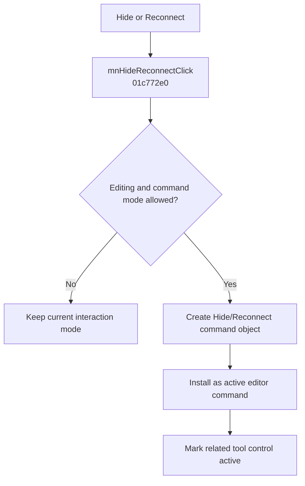

# &Hide/Reconnect

> Analysis status: Evidence-backed behavior recovered.

## Control

| Property | Recovered value |
| --- | --- |
| Form | SchematicEditor |
| Component path | SchematicEditor.MainMenu.Edit.mnHideReconnect |
| Control class | TMenuItem |
| Caption | &Hide/Reconnect |
| Hint | Not present in the recovered resource. |
| Text | Not present in the recovered resource. |
| Handler name | mnHideReconnectClick |
| Handler address | 01c772e0 |
| Graph node | `resource:dfm:SchematicEditor/SchematicEditor.MainMenu.Edit.mnHideReconnect` |
| Handler node | `function:01c772e0` |
| Graph layer | UI |

## What happens when clicked

The click handler delegates to `FUN_01C6D920`. That helper first requires the shared edit guard to return false and the alternate command-mode flag to be zero. It then creates a command object from `PTR_FUN_01362168`, associates it with the Schematic Editor, installs it in the active-command field at decimal offset 7000, and sets the related control at offset `0xBB0` active through `FUN_0082A6C0(..., 1)`.

This enters the Hide/Reconnect interaction mode. It does not hide or reconnect an object until the user performs the next canvas interaction. A blocked edit state makes the click a no-op.

## Click flow

## Handler evidence

- Source: [DecompiledSources/Tina16/functions/0000000001C772E0__FUN_01c772e0.c](../../../DecompiledSources/Tina16/functions/0000000001C772E0__FUN_01c772e0.c)
- Recovered role: Activates the Schematic Editor Hide/Reconnect interaction mode.
- Current graph summary: Handles 1 Delphi UI event: SchematicEditor.MainMenu.Edit.mnHideReconnect.OnClick.
- Current graph behavior: The wrapper installs a dedicated editor command object and activates the associated tool control; later canvas input performs the object action.
- Current graph evidence: `FUN_01C6D920` creates the command object, `FUN_01C6CEE0` replaces the active command at offset 7000, and `FUN_01C6D670` activates control `0xBB0`.
- Complexity: simple
- Distinct outgoing calls: 1

## Direct calls

- `function:01c6d920` — Handles 1 Delphi UI event: SchematicEditor.TopToolBar.EditorTools.ToolHideRecon.OnClick.

## Resource evidence

- Kind: Not present in the recovered resource.
- Modal result: Not present in the recovered resource.
- Checked state: Not present in the recovered resource.
- List items: Not present in the recovered resource.
- Image reference: Not present in the recovered resource.
- Extracted glyph: None.

## Nearby label candidates

Nearby labels are layout candidates only. They are not proof of behavior.

- No same-parent label candidate is available.

## Analysis limits

- This click only arms the mode. The later canvas event decides which object is hidden or reconnected.

