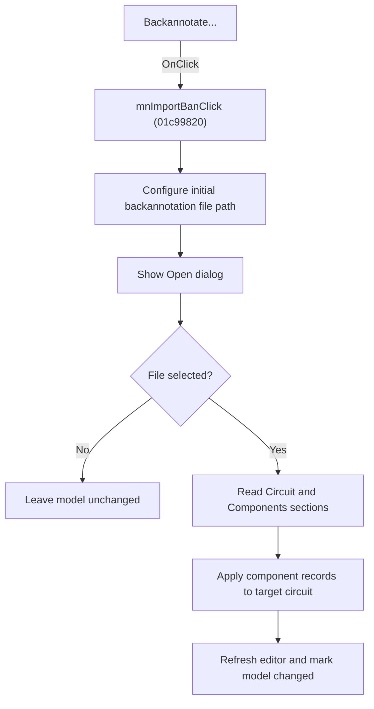

# Backannotate...

> Analysis status: Source, graph, file-dialog, and importer evidence reviewed.

## Control

| Property | Recovered value |
| --- | --- |
| Form | SchematicEditor |
| Component path | SchematicEditor.MainMenu.mnTools.mnPCBTools.mnImportBan |
| Control class | TMenuItem |
| Caption | Backannotate... |
| Hint | Not present in the recovered resource. |
| Text | Not present in the recovered resource. |
| Handler name | mnImportBanClick |
| Handler address | 01c99820 |
| Graph node | `resource:dfm:SchematicEditor/SchematicEditor.MainMenu.mnTools.mnPCBTools.mnImportBan` |
| Handler node | `function:01c99820` |
| Graph layer | UI |

## What happens when clicked

The command configures a Schematic Editor Open dialog with the recovered backannotation file name and an application-relative initial path. It then shows the dialog. Cancel causes no model change.

When the user selects a file, the handler passes that path to the shared backannotation importer. The importer reads the `Circuit` name and the `Components` sections, resolves or creates the target circuit context, applies each recovered component record, refreshes the editor client, and marks the current model changed. The outer handler has no local rollback or error message.

## Click flow

## Handler evidence

- Source: [DecompiledSources/Tina16/functions/0000000001C99820__FUN_01c99820.c](../../../DecompiledSources/Tina16/functions/0000000001C99820__FUN_01c99820.c)
- Recovered role: Opens a backannotation file and applies its circuit component records.
- Current graph summary: Configures and executes an Open dialog, then runs the shared backannotation importer for the accepted file.
- Current graph behavior: Cancel is a no-op. An accepted file can change the target circuit, refresh the editor, and mark the model modified.
- Current graph evidence: `FUN_01c99820` configures the dialog at editor offset `0x1900`, executes it through virtual slot `+0xA8`, retrieves the accepted path, and calls `FUN_01bb4cc0(path,0,0)`. That callee reads `Circuit`/`Name` and `Components`, calls `FUN_01bb4930` for component records, refreshes the current editor client, and calls `FUN_0199e310(model,0,1,0)`.
- Complexity: complex
- Distinct outgoing calls: 6

## Direct calls

- `function:00414480` — Delphi UnicodeString clear and finalization helper
- `function:00414ad0` — Delphi UnicodeString assignment helper
- `function:00416cd0` — FUN_00416cd0
- `function:00724270` — FUN_00724270
- `function:00724380` — FUN_00724380
- `function:01bb4cc0` — FUN_01bb4cc0

## Resource evidence

- Kind: Not present in the recovered resource.
- Modal result: Not present in the recovered resource.
- Checked state: Not present in the recovered resource.
- List items: Not present in the recovered resource.
- Image reference: Not present in the recovered resource.
- Extracted glyph: None.

## Nearby label candidates

Nearby labels are layout candidates only. They are not proof of behavior.

- No same-parent label candidate is available.

## Analysis limits

- The default file-name literal and filter text are not decoded in the recovered C output.
- The importer does not return a status to the outer handler, and the outer handler has no rollback branch.

