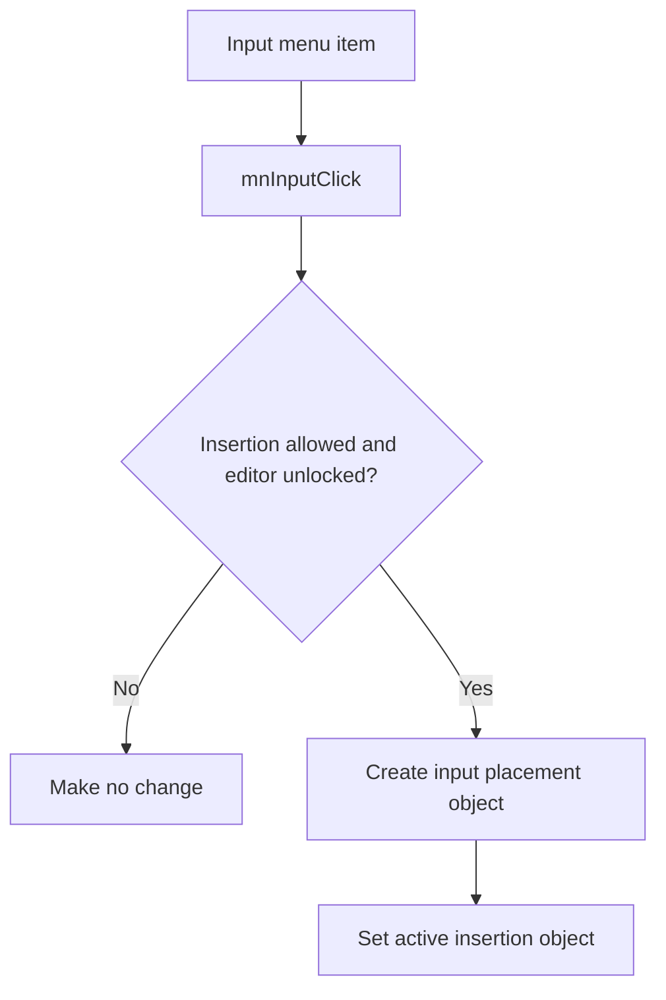

# &Input

> Analysis status: Reviewed with recovered insertion-state evidence.

## Control

| Property | Recovered value |
| --- | --- |
| Component path | `SchematicEditor.MainMenu.Insert.mnInput` |
| Control class | `TMenuItem` |
| Handler | `mnInputClick` at `01c773c0` |

## What happens when clicked

The command does nothing when the editor blocks insertion or the global edit lock is active. Otherwise, it constructs the input placement object and replaces any previous active insertion object with it. The click stages input placement. It does not add the input to the schematic until the user completes placement.

## Click flow

## Evidence

- [Handler source](../../../DecompiledSources/Tina16/functions/0000000001C773C0__FUN_01c773c0.c) applies both guards, uses the input-specific constructor, and stores the result.
- [Active-object setter](../../../DecompiledSources/Tina16/functions/0000000001C6CEE0__FUN_01c6cee0.c) disposes the previous insertion object before it stores the new object.

## Analysis limits

- The recovered constructor symbol does not expose the Delphi input class name.
