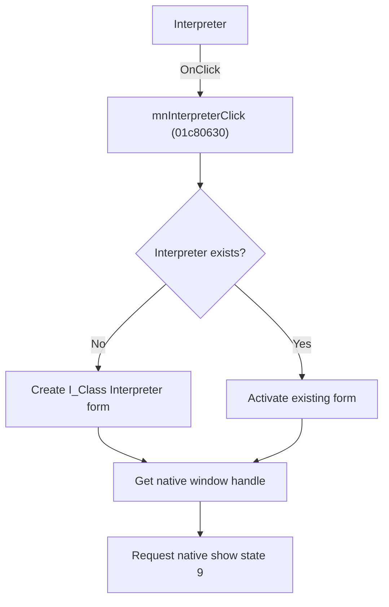

# &Interpreter

> Analysis status: Source, graph, and form evidence reviewed.

## Control

| Property | Recovered value |
| --- | --- |
| Form | SchematicEditor |
| Component path | SchematicEditor.MainMenu.mnTools.mnInterpreter |
| Control class | TMenuItem |
| Caption | &Interpreter |
| Hint | Not present in the recovered resource. |
| Text | Not present in the recovered resource. |
| Handler name | mnInterpreterClick |
| Handler address | 01c80630 |
| Graph node | `resource:dfm:SchematicEditor/SchematicEditor.MainMenu.mnTools.mnInterpreter` |
| Handler node | `function:01c80630` |
| Graph layer | UI |

## What happens when clicked

The command opens the singleton `I_Class` Interpreter form. If the shared interpreter pointer is empty, it constructs the form and stores it. If the form already exists, it activates that instance. The handler then gets the native window handle and requests native show-state value `9` so that the Interpreter returns to its displayed state.

The command does not load, clear, or run an interpreter file. It preserves the current Interpreter editor state on reuse.

## Click flow

## Handler evidence

- Source: [DecompiledSources/Tina16/functions/0000000001C80630__FUN_01c80630.c](../../../DecompiledSources/Tina16/functions/0000000001C80630__FUN_01c80630.c)
- Recovered role: Creates or restores the singleton Interpreter form.
- Current graph summary: Opens `I_Class`, reuses an existing instance, and requests native show state `9`.
- Current graph behavior: Existing source text and form state remain intact. This command does not run the interpreter.
- Current graph evidence: The class at `PTR_FUN_017ec3a8` maps to recovered form `TI_Class`, caption `Interpreter-<%s>`, with its file, edit, and run controls. `FUN_01c80630` constructs it into `PTR_DAT_02002d20` only when null, otherwise calls the form activation path, then gets its native handle and dispatches value `9`.
- Complexity: complex
- Distinct outgoing calls: 3

## Direct calls

- `function:0064e1d0` — FUN_0064e1d0
- `function:0065b870` — FUN_0065b870
- `function:01aebb40` — FUN_01aebb40

## Resource evidence

- Kind: Not present in the recovered resource.
- Modal result: Not present in the recovered resource.
- Checked state: Not present in the recovered resource.
- List items: Not present in the recovered resource.
- Image reference: Not present in the recovered resource.
- Extracted glyph: None.

## Nearby label candidates

Nearby labels are layout candidates only. They are not proof of behavior.

- No same-parent label candidate is available.

## Analysis limits

- The imported native function name behind the final thunk is not present in the graph.
- File loading and execution are separate Interpreter form events.

