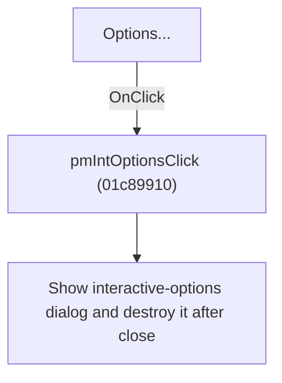

# Options...

> Analysis status: Individually reviewed.

## Control

| Property | Recovered value |
| --- | --- |
| Form | SchematicEditor |
| Component path | SchematicEditor.MainMenu.mnInteractive.mnIntOptions |
| Control class | TMenuItem |
| Caption | Options... |
| Hint | Not present in the recovered resource. |
| Text | Not present in the recovered resource. |
| Handler name | pmIntOptionsClick |
| Handler address | 01c89910 |
| Graph node | `resource:dfm:SchematicEditor/SchematicEditor.MainMenu.mnInteractive.mnIntOptions` |
| Handler node | `function:01c89910` |
| Graph layer | UI |

## What happens when clicked

The handler constructs the interaction-options dialog, shows it modally, and destroys it after the dialog closes. Sender is unused, so the menu and popup controls behave identically.

## Click flow

## Handler evidence

- Source: [DecompiledSources/Tina16/functions/0000000001C89910__FUN_01c89910.c](../../../DecompiledSources/Tina16/functions/0000000001C89910__FUN_01c89910.c)
- Recovered role: Open interactive-simulation options.
- Current graph summary: Handles 2 Delphi UI events: SchematicEditor.MainMenu.mnInteractive.mnIntOptions.OnClick, SchematicEditor.PopupInteract.pmIntOptions.OnClick.
- Current graph behavior: The handler constructs the interaction-options dialog, shows it modally, and destroys it after the dialog closes. Sender is unused, so the menu and popup controls behave identically.
- Current graph evidence: The recovered body allocates one form object, invokes its modal method, and releases it through the nil-safe destruction helper. Two DFM controls share the handler.
- Complexity: moderate
- Distinct outgoing calls: 2

## Direct calls

- `function:00410f20` — Nil-safe Delphi object destruction helper
- `function:007fc180` — FUN_007fc180

## Resource evidence

- Kind: Not present in the recovered resource.
- Modal result: Not present in the recovered resource.
- Checked state: Not present in the recovered resource.
- List items: Not present in the recovered resource.
- Image reference: Not present in the recovered resource.
- Extracted glyph: None.

## Nearby label candidates

Nearby labels are layout candidates only. They are not proof of behavior.

- No same-parent label candidate is available.

## Analysis limits

- The dialog's individual settings are documented by its own control articles.

