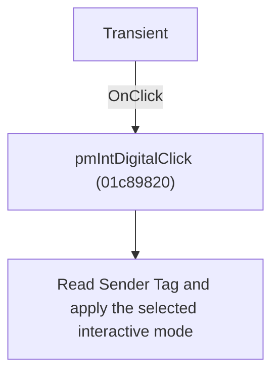

# Transient

> Analysis status: Individually reviewed.

## Control

| Property | Recovered value |
| --- | --- |
| Form | SchematicEditor |
| Component path | SchematicEditor.MainMenu.mnInteractive.mnIntTransient |
| Control class | TMenuItem |
| Caption | Transient |
| Hint | Not present in the recovered resource. |
| Text | Not present in the recovered resource. |
| Handler name | pmIntDigitalClick |
| Handler address | 01c89820 |
| Graph node | `resource:dfm:SchematicEditor/SchematicEditor.MainMenu.mnInteractive.mnIntTransient` |
| Handler node | `function:01c89820` |
| Graph layer | UI |

## What happens when clicked

The handler reads the clicked menu item's Tag, stores it as the current interactive mode, and passes it to the mode-application helper. Each AC, DC, Digital, Transient, or Transient Single Shot item therefore selects its own resource-named mode; main-menu and popup counterparts share the same path.

## Click flow

## Handler evidence

- Source: [DecompiledSources/Tina16/functions/0000000001C89820__FUN_01c89820.c](../../../DecompiledSources/Tina16/functions/0000000001C89820__FUN_01c89820.c)
- Recovered role: Select an interactive simulation mode.
- Current graph summary: Handles 10 Delphi UI events: SchematicEditor.MainMenu.mnInteractive.mnIntDC.OnClick, SchematicEditor.MainMenu.mnInteractive.mnIntAC.OnClick, SchematicEditor.MainMenu.mnInteractive.mnIntTransient.OnClick.
- Current graph behavior: The handler reads the clicked menu item's Tag, stores it as the current interactive mode, and passes it to the mode-application helper. Each AC, DC, Digital, Transient, or Transient Single Shot item therefore selects its own resource-named mode; main-menu and popup counterparts share the same path.
- Current graph evidence: The recovered body reads Sender offset 0x18, stores that value in shared state, and calls FUN_01c89690 with it. Ten DFM controls with five paired captions share this address.
- Complexity: simple
- Distinct outgoing calls: 1

## Direct calls

- `function:01c89690` — FUN_01c89690

## Resource evidence

- Kind: Not present in the recovered resource.
- Modal result: Not present in the recovered resource.
- Checked state: Not present in the recovered resource.
- List items: Not present in the recovered resource.
- Image reference: Not present in the recovered resource.
- Extracted glyph: None.

## Nearby label candidates

Nearby labels are layout candidates only. They are not proof of behavior.

- No same-parent label candidate is available.

## Analysis limits

- The checked-in UI evidence omits numeric Tag values, so the numeric mode codes are not stated.

