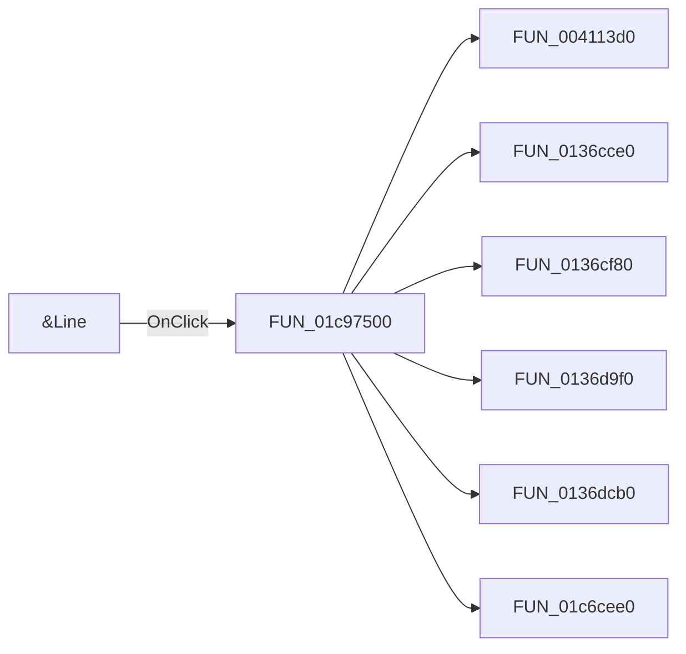

# &Line

> Analysis status: Pending individual source review.

## Control

| Property | Recovered value |
| --- | --- |
| Form | SchematicEditor |
| Component path | SchematicEditor.MainMenu.Insert.mnShape.mnLine |
| Control class | TMenuItem |
| Caption | &Line |
| Hint | Not present in the recovered resource. |
| Text | Not present in the recovered resource. |
| Handler name | InsertShape |
| Handler address | 01c97500 |
| Graph node | `resource:dfm:SchematicEditor/SchematicEditor.MainMenu.Insert.mnShape.mnLine` |
| Handler node | `function:01c97500` |
| Graph layer | UI |

## What happens when clicked

Pending individual analysis. An agent must read the recovered handler source and its relevant callees before it replaces this text.

## Click flow

## Handler evidence

- Source: [DecompiledSources/Tina16/functions/0000000001C97500__FUN_01c97500.c](../../../DecompiledSources/Tina16/functions/0000000001C97500__FUN_01c97500.c)
- Recovered role: Not present in the recovered resource.
- Current graph summary: Handles 8 Delphi UI events: SchematicEditor.MainMenu.Insert.mnShape.mnLine.OnClick, SchematicEditor.MainMenu.Insert.mnShape.mnArrow.mnArrowLinear.OnClick, SchematicEditor.MainMenu.Insert.mnShape.mnArrow.mnArrowRoundedCorner.OnClick.
- Current graph behavior: Not present in the recovered resource.
- Current graph evidence: Not present in the recovered resource.
- Complexity: complex
- Distinct outgoing calls: 8

## Direct calls

- `function:004113d0` — FUN_004113d0
- `function:0136cce0` — FUN_0136cce0
- `function:0136cf80` — FUN_0136cf80
- `function:0136d9f0` — FUN_0136d9f0
- `function:0136dcb0` — FUN_0136dcb0
- `function:01c6cee0` — FUN_01c6cee0
- `function:01c6d670` — FUN_01c6d670
- `function:01c8cee0` — FUN_01c8cee0

## Resource evidence

- Kind: Not present in the recovered resource.
- Modal result: Not present in the recovered resource.
- Checked state: Not present in the recovered resource.
- List items: Not present in the recovered resource.
- Image reference: Not present in the recovered resource.
- Extracted glyph: None.

## Nearby label candidates

Nearby labels are layout candidates only. They are not proof of behavior.

- No same-parent label candidate is available.

## Analysis limits

- Do not infer behavior from the control class, caption, hint, glyph, or nearby label alone.
- Do not replace the pending status until the handler source and relevant call path provide enough evidence.
