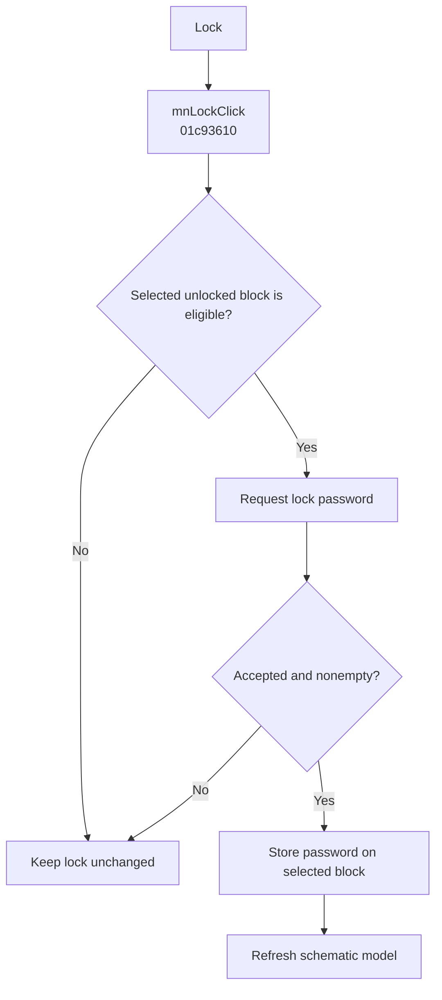

# Lock...

> Analysis status: Evidence-backed behavior recovered.

## Control

| Property | Recovered value |
| --- | --- |
| Form | SchematicEditor |
| Component path | SchematicEditor.MainMenu.Edit.Sharing1.mnLock |
| Control class | TMenuItem |
| Caption | Lock... |
| Hint | Not present in the recovered resource. |
| Text | Not present in the recovered resource. |
| Handler name | mnLockClick |
| Handler address | 01c93610 |
| Graph node | `resource:dfm:SchematicEditor/SchematicEditor.MainMenu.Edit.Sharing1.mnLock` |
| Handler node | `function:01c93610` |
| Graph layer | UI |

## What happens when clicked

The handler gets the current selection from the schematic model at form offset `0x27A8`. It continues only when the selected object exists, has recovered type value 4, passes the edit predicate, has its lock-capable flag set, and has no stored password. It opens an input dialog titled “Lock password.” If the user accepts and enters a nonempty password, the handler stores that string on the selected block and refreshes the model. Cancel, empty input, failed guards, or an existing password makes no change.

## Click flow

## Handler evidence

- Source: [DecompiledSources/Tina16/functions/0000000001C93610__FUN_01c93610.c](../../../DecompiledSources/Tina16/functions/0000000001C93610__FUN_01c93610.c)
- Recovered role: Adds a password lock to the selected eligible block.
- Current graph summary: Handles 1 Delphi UI event: SchematicEditor.MainMenu.Edit.Sharing1.mnLock.OnClick.
- Current graph behavior: The handler requests a nonempty password, stores it on an eligible unlocked block, and refreshes the model.
- Current graph evidence: The source contains the password prompt, tests the converted string for nonzero length, calls the selected object's virtual setter with that string, and then calls `FUN_0199E310`.
- Complexity: complex
- Distinct outgoing calls: 7

## Direct calls

- `function:00414480` — Delphi UnicodeString clear and finalization helper
- `function:0043ea00` — FUN_0043ea00
- `function:0072f4e0` — FUN_0072f4e0
- `function:0198a580` — FUN_0198a580
- `function:01993ec0` — FUN_01993ec0
- `function:0199e310` — FUN_0199e310
- `function:01d04d40` — FUN_01d04d40

## Resource evidence

- Kind: Not present in the recovered resource.
- Modal result: Not present in the recovered resource.
- Checked state: Not present in the recovered resource.
- List items: Not present in the recovered resource.
- Image reference: Not present in the recovered resource.
- Extracted glyph: None.

## Nearby label candidates

Nearby labels are layout candidates only. They are not proof of behavior.

- No same-parent label candidate is available.

## Analysis limits

- The source proves the stored password input. It does not expose encryption or persistent storage details.

