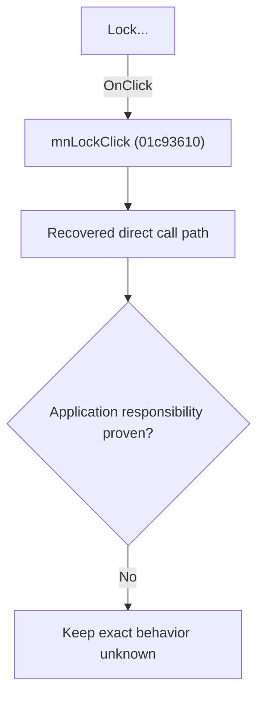

# Lock...

> Analysis status: Blocked by an exact evidence gap.

## Control

| Property | Recovered value |
| --- | --- |
| Form | SchematicEditor |
| Component path | SchematicEditor.MainMenu.Edit.Sharing1.mnLock |
| Control class | TMenuItem |
| Caption | Lock... |
| Hint | Not present in the recovered resource. |
| Text | Not present in the recovered resource. |
| Handler name | mnLockClick |
| Handler address | 01c93610 |
| Graph node | `resource:dfm:SchematicEditor/SchematicEditor.MainMenu.Edit.Sharing1.mnLock` |
| Handler node | `function:01c93610` |
| Graph layer | UI |

## What happens when clicked

The OnClick binding reaches mnLockClick at 01c93610. The recovered body has 7 distinct outgoing graph call(s), but the application-specific responsibilities and data effects of its downstream path are not established in the accepted graph evidence. The control's caption or name indicates user intent only; it is not enough to claim implementation behavior.

## Click flow

## Handler evidence

- Source: [DecompiledSources/Tina16/functions/0000000001C93610__FUN_01c93610.c](../../../DecompiledSources/Tina16/functions/0000000001C93610__FUN_01c93610.c)
- Recovered role: Evidence-blocked mnLockClick command.
- Current graph summary: Handles 1 Delphi UI event: SchematicEditor.MainMenu.Edit.Sharing1.mnLock.OnClick.
- Current graph behavior: The OnClick binding reaches mnLockClick at 01c93610. The recovered body has 7 distinct outgoing graph call(s), but the application-specific responsibilities and data effects of its downstream path are not established in the accepted graph evidence. The control's caption or name indicates user intent only; it is not enough to claim implementation behavior.
- Current graph evidence: The DFM binds SchematicEditor.MainMenu.Edit.Sharing1.mnLock to mnLockClick. The recovered source is DecompiledSources/Tina16/functions/0000000001C93610__FUN_01c93610.c and directly references 00414480, 0043ea00, 0072f4e0, 0198a580, 01993ec0, 0199e310, 01d04d40. No accepted end-to-end role was established for this control path.
- Complexity: complex
- Distinct outgoing calls: 7

## Direct calls

- `function:00414480` — Delphi UnicodeString clear and finalization helper
- `function:0043ea00` — FUN_0043ea00
- `function:0072f4e0` — FUN_0072f4e0
- `function:0198a580` — FUN_0198a580
- `function:01993ec0` — FUN_01993ec0
- `function:0199e310` — FUN_0199e310
- `function:01d04d40` — FUN_01d04d40

## Resource evidence

- Kind: Not present in the recovered resource.
- Modal result: Not present in the recovered resource.
- Checked state: Not present in the recovered resource.
- List items: Not present in the recovered resource.
- Image reference: Not present in the recovered resource.
- Extracted glyph: None.

## Nearby label candidates

Nearby labels are layout candidates only. They are not proof of behavior.

- No same-parent label candidate is available.

## Analysis limits

- Exact gap: the recovered handler or one of its direct application callees lacks a source-supported role that proves the command's decisions, state changes, and output. Keep this Bead open until those callees are traced.

