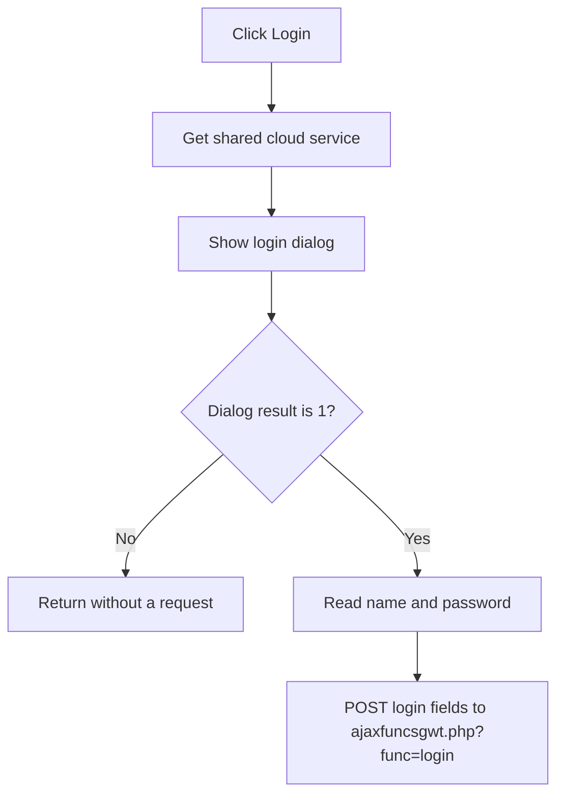

# Login ...

> Analysis status: Reviewed from recovered login-dialog and HTTP request construction.

## Control

| Property | Recovered value |
| --- | --- |
| Form | SchematicEditor |
| Component path | SchematicEditor.MainMenu.mnFile.mnCloud.mnLoginToCloud |
| Control class | TMenuItem |
| Caption | Login ... |
| Hint | Not present in the recovered resource. |
| Text | Not present in the recovered resource. |
| Handler name | mnLoginToCloudClick |
| Handler address | 01c937a0 |
| Graph node | `resource:dfm:SchematicEditor/SchematicEditor.MainMenu.mnFile.mnCloud.mnLoginToCloud` |
| Handler node | `function:01c937a0` |
| Graph layer | UI |

## What happens when clicked

The handler gets the shared cloud-service object and calls its login operation. The operation creates the recovered login dialog. If the dialog does not return result 1, it sends no request. If the user accepts it, the operation reads the dialog name and password, builds `name=` and `password=` form fields, and posts them to `ajaxfuncsgwt.php?func=login` under the configured service base URL.

The click wrapper does not inspect a return value and has no local error branch. Network and authentication results are handled inside the cloud-service request path.

## Click flow

## Handler evidence

- Source: [DecompiledSources/Tina16/functions/0000000001C937A0__FUN_01c937a0.c](../../../DecompiledSources/Tina16/functions/0000000001C937A0__FUN_01c937a0.c)
- Recovered role: Open the cloud login dialog and submit accepted credentials.
- Current graph summary: Handles 1 Delphi UI event: SchematicEditor.MainMenu.mnFile.mnCloud.mnLoginToCloud.OnClick.
- Current graph behavior: Gets the singleton cloud object and runs its dialog-gated login request.
- Current graph evidence: `FUN_01c937a0` calls `FUN_014c0b50` and `FUN_014c3f60`. The latter checks dialog result 1, reads two dialog values, builds the exact endpoint and field prefixes, and calls the shared HTTP request worker.
- Complexity: moderate
- Distinct outgoing calls: 2

## Direct calls

- `function:014c0b50` — FUN_014c0b50
- `function:014c3f60` — FUN_014c3f60

## Resource evidence

- Kind: Not present in the recovered resource.
- Modal result: Not present in the recovered resource.
- Checked state: Not present in the recovered resource.
- List items: Not present in the recovered resource.
- Image reference: Not present in the recovered resource.
- Extracted glyph: None.

## Nearby label candidates

Nearby labels are layout candidates only. They are not proof of behavior.

- No same-parent label candidate is available.

## Analysis limits

- The recovered function does not expose how the server response maps to the final authenticated-session fields or the exact error text.

