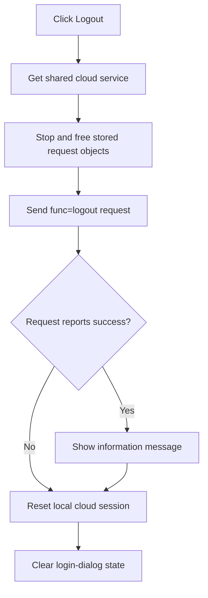

# Logout

> Analysis status: Reviewed from recovered cloud request cleanup, logout request, and local-session reset paths.

## Control

| Property | Recovered value |
| --- | --- |
| Form | SchematicEditor |
| Component path | SchematicEditor.MainMenu.mnFile.mnCloud.mnLogoutFromCloud |
| Control class | TMenuItem |
| Caption | Logout |
| Hint | Not present in the recovered resource. |
| Text | Not present in the recovered resource. |
| Handler name | mnLogoutFromCloudClick |
| Handler address | 01c937c0 |
| Graph node | `resource:dfm:SchematicEditor/SchematicEditor.MainMenu.mnFile.mnCloud.mnLogoutFromCloud` |
| Handler node | `function:01c937c0` |
| Graph layer | UI |

## What happens when clicked

The handler gets the shared cloud-service object, stops and frees any request object stored at service offset `+0x38`, and frees the auxiliary object at `+0x40`. It then sends a logout request to `ajaxfuncsgwt.php?func=logout`.

When the request reports success, the cloud routine shows a resource-backed information message. Regardless of that request result, it resets the recovered cloud-session manager and clears the login-dialog state. The click wrapper ignores the Boolean request result and has no additional error branch.

## Click flow

## Handler evidence

- Source: [DecompiledSources/Tina16/functions/0000000001C937C0__FUN_01c937c0.c](../../../DecompiledSources/Tina16/functions/0000000001C937C0__FUN_01c937c0.c)
- Recovered role: End the cloud session and reset local login state.
- Current graph summary: Handles 1 Delphi UI event: SchematicEditor.MainMenu.mnFile.mnCloud.mnLogoutFromCloud.OnClick.
- Current graph behavior: Cleans up active request objects, sends the logout endpoint request, and resets session and dialog state.
- Current graph evidence: `FUN_01c937c0` calls `FUN_014c47f0` then `FUN_014c46b0` on the same singleton. Those bodies expose the two object fields, the exact endpoint suffix, the success-only message, and unconditional local resets.
- Complexity: complex
- Distinct outgoing calls: 3

## Direct calls

- `function:014c0b50` — FUN_014c0b50
- `function:014c46b0` — FUN_014c46b0
- `function:014c47f0` — FUN_014c47f0

## Resource evidence

- Kind: Not present in the recovered resource.
- Modal result: Not present in the recovered resource.
- Checked state: Not present in the recovered resource.
- List items: Not present in the recovered resource.
- Image reference: Not present in the recovered resource.
- Extracted glyph: None.

## Nearby label candidates

Nearby labels are layout candidates only. They are not proof of behavior.

- No same-parent label candidate is available.

## Analysis limits

- The message text comes from a resource pointer and is not present as a literal in the recovered body.
- The wrapper does not report a failed logout request itself.

