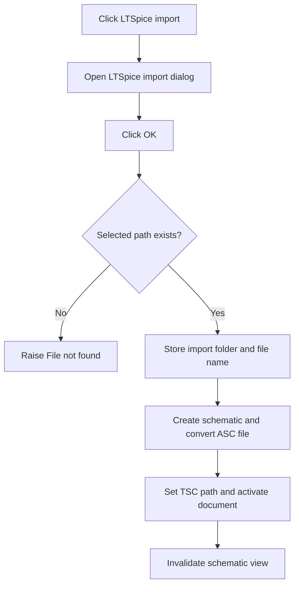

# LTSpice File (*.asc)...

> Analysis status: Reviewed from the LTspice import dialog and OK-button conversion path.

## Control

| Property | Recovered value |
| --- | --- |
| Form | SchematicEditor |
| Component path | SchematicEditor.MainMenu.mnFile.Import.mnLTSpiceImport |
| Control class | TMenuItem |
| Caption | LTSpice File (*.asc)... |
| Hint | Not present in the recovered resource. |
| Text | Not present in the recovered resource. |
| Handler name | mnLTSpiceImportClick |
| Handler address | 01c937f0 |
| Graph node | `resource:dfm:SchematicEditor/SchematicEditor.MainMenu.mnFile.Import.mnLTSpiceImport` |
| Handler node | `function:01c937f0` |
| Graph layer | UI |

## What happens when clicked

The handler opens `LTSpiceImportDlg` and destroys it after the modal dialog closes. The dialog owns the actual import. Its OK button checks that the selected path exists and raises `File not found` for a missing path. For a valid path, it stores the LTspice import directory and file name, creates a new schematic, converts the selected ASC file, derives a `.tsc` document path, makes the imported document active, and invalidates the schematic view.

## Click flow

## Handler evidence

- Source: [DecompiledSources/Tina16/functions/0000000001C937F0__FUN_01c937f0.c](../../../DecompiledSources/Tina16/functions/0000000001C937F0__FUN_01c937f0.c)
- Recovered role: Open the LTspice schematic import dialog.
- Current graph summary: Handles 1 Delphi UI event: SchematicEditor.MainMenu.mnFile.Import.mnLTSpiceImport.OnClick.
- Current graph behavior: Shows the LTspice import dialog. The dialog OK path validates the file, converts it into a new active TINA schematic, and refreshes the view.
- Current graph evidence: `FUN_01c937f0` constructs the class identified by the DFM as `LTSpiceImportDlg`, shows it modally, and destroys it. The separately annotated `bOK` handler at `01b90000` checks file existence, writes `LT_ImportDir` and `LT_ImportFileName`, creates a new schematic, runs the LTspice conversion, replaces the extension with `.tsc`, updates the active document, and calls `FUN_01ca2aa0`, which invalidates the view control at dialog offset `+0xa10`.
- Complexity: complex
- Distinct outgoing calls: 4

## Direct calls

- `function:00410f20` — Nil-safe Delphi object destruction helper
- `function:00414480` — Delphi UnicodeString clear and finalization helper
- `function:00414560` — Delphi UnicodeString array finalization helper
- `function:007fc180` — FUN_007fc180

## Resource evidence

- Kind: Not present in the recovered resource.
- Modal result: Not present in the recovered resource.
- Checked state: Not present in the recovered resource.
- List items: Not present in the recovered resource.
- Image reference: Not present in the recovered resource.
- Extracted glyph: None.

## Nearby label candidates

Nearby labels are layout candidates only. They are not proof of behavior.

- No same-parent label candidate is available.

## Analysis limits

- The menu handler does not inspect the modal result because the dialog OK handler performs the import before the dialog closes.
- Converter-internal diagnostics appear in the dialog messages control and are below this menu handler.

