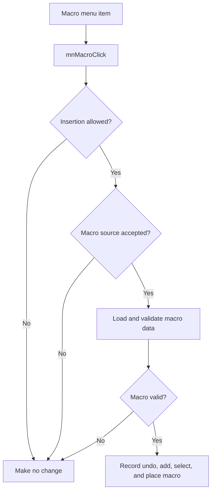

# &Macro...

> Analysis status: Reviewed with recovered source-selection and placement evidence.

## Control

| Property | Recovered value |
| --- | --- |
| Component path | `SchematicEditor.MainMenu.Insert.mnMacro` |
| Control class | `TMenuItem` |
| Handler | `mnMacroClick` at `01c89ba0` |

## What happens when clicked

The command stops when the editor blocks insertion or when the macro source is not accepted. After acceptance, it copies the selected source path into editor state and starts the common insertion path with object type `0x39`. That path loads and validates the macro data. A failed load destroys the temporary object and makes no schematic change. A valid macro gets undo data, is added at the current insertion coordinates, becomes selected, and activates placement state.

## Click flow

## Evidence

- [Handler source](../../../DecompiledSources/Tina16/functions/0000000001C89BA0__FUN_01c89ba0.c) accepts the source, stores its path, and selects insertion type `0x39`.
- [Common insertion path](../../../DecompiledSources/Tina16/functions/0000000001C6EC30__FUN_01c6ec30.c) contains the type-`0x39` load, validation, undo, add, coordinate, selection, and failure paths.

## Analysis limits

- The recovered code does not expose the user-facing validation messages.
