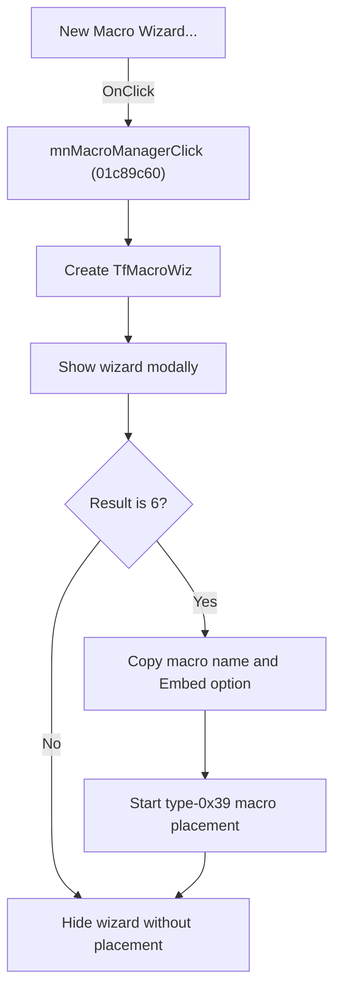

# New &Macro Wizard...

> Analysis status: Source, graph, wizard, and placement evidence reviewed.

## Control

| Property | Recovered value |
| --- | --- |
| Form | SchematicEditor |
| Component path | SchematicEditor.MainMenu.mnTools.mnMacroManager |
| Control class | TMenuItem |
| Caption | New &Macro Wizard... |
| Hint | Not present in the recovered resource. |
| Text | Not present in the recovered resource. |
| Handler name | mnMacroManagerClick |
| Handler address | 01c89c60 |
| Graph node | `resource:dfm:SchematicEditor/SchematicEditor.MainMenu.mnTools.mnMacroManager` |
| Handler node | `function:01c89c60` |
| Graph layer | UI |

## What happens when clicked

The command creates `TfMacroWiz`, whose caption is `New Macro Wizard`, and shows it modally. If the wizard returns result `6`, the handler copies the completed macro name into the Schematic Editor, reads the wizard's `Embed macro in circuit` option, and starts placement of a type-`0x39` macro component through the normal editor insertion path.

Any other modal result skips macro placement. The handler hides the temporary wizard after either result. The wizard owns source selection, shape selection, name validation, and macro-file creation before it returns the accepted result.

## Click flow

## Handler evidence

- Source: [DecompiledSources/Tina16/functions/0000000001C89C60__FUN_01c89c60.c](../../../DecompiledSources/Tina16/functions/0000000001C89C60__FUN_01c89c60.c)
- Recovered role: Runs the New Macro Wizard and starts placement of the accepted macro.
- Current graph summary: Shows `TfMacroWiz` modally and, for result `6`, transfers the accepted macro data to the Schematic Editor insertion path.
- Current graph behavior: Cancel or any result other than `6` performs no placement. The temporary wizard is hidden after either result.
- Current graph evidence: The class at `PTR_FUN_01c34750` maps to `TfMacroWiz`. The handler copies wizard offset `0xC08` to editor offset `0x2760`, reads the control at `0x8C8`, and calls `FUN_01c6ec30(editor,0x39,1,1,option)`. The wizard form-create path makes offset `0x8C8` visible from the `EnableMacroEmbedding` setting, and the DFM identifies the matching final option as `Embed macro in circuit`.
- Complexity: complex
- Distinct outgoing calls: 4

## Direct calls

- `function:00414ad0` — Delphi UnicodeString assignment helper
- `function:007fc180` — FUN_007fc180
- `function:00805ad0` — FUN_00805ad0
- `function:01c6ec30` — FUN_01c6ec30

## Resource evidence

- Kind: Not present in the recovered resource.
- Modal result: Not present in the recovered resource.
- Checked state: Not present in the recovered resource.
- List items: Not present in the recovered resource.
- Image reference: Not present in the recovered resource.
- Extracted glyph: None.

## Nearby label candidates

Nearby labels are layout candidates only. They are not proof of behavior.

- No same-parent label candidate is available.

## Analysis limits

- The recovered source does not assign a symbolic name to modal result `6`.
- Placement success or cancellation after the wizard closes belongs to the general editor insertion path.

