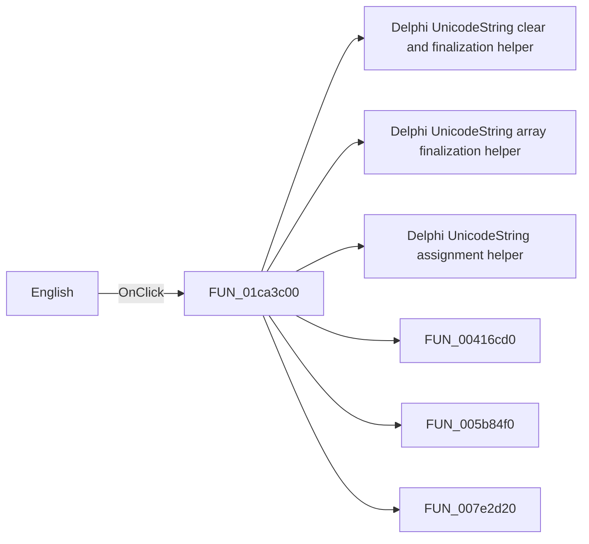

# English

> Analysis status: Pending individual source review.

## Control

| Property | Recovered value |
| --- | --- |
| Form | SchematicEditor |
| Component path | SchematicEditor.MainMenu.View.mnLanguage.mnNative |
| Control class | TMenuItem |
| Caption | English |
| Hint | Not present in the recovered resource. |
| Text | Not present in the recovered resource. |
| Handler name | ChangeLanguageClick |
| Handler address | 01ca3c00 |
| Graph node | `resource:dfm:SchematicEditor/SchematicEditor.MainMenu.View.mnLanguage.mnNative` |
| Handler node | `function:01ca3c00` |
| Graph layer | UI |

## What happens when clicked

Pending individual analysis. An agent must read the recovered handler source and its relevant callees before it replaces this text.

## Click flow

## Handler evidence

- Source: [DecompiledSources/Tina16/functions/0000000001CA3C00__FUN_01ca3c00.c](../../../DecompiledSources/Tina16/functions/0000000001CA3C00__FUN_01ca3c00.c)
- Recovered role: Not present in the recovered resource.
- Current graph summary: Handles 2 Delphi UI events: SchematicEditor.MainMenu.View.mnLanguage.mnNative.OnClick, SchematicEditor.MainMenu.View.mnLanguage.mnOther1.OnClick.
- Current graph behavior: Not present in the recovered resource.
- Current graph evidence: Not present in the recovered resource.
- Complexity: complex
- Distinct outgoing calls: 16

## Direct calls

- `function:00414480` — Delphi UnicodeString clear and finalization helper
- `function:00414560` — Delphi UnicodeString array finalization helper
- `function:00414ad0` — Delphi UnicodeString assignment helper
- `function:00416cd0` — FUN_00416cd0
- `function:005b84f0` — FUN_005b84f0
- `function:007e2d20` — FUN_007e2d20
- `function:00b89270` — FUN_00b89270
- `function:00b898e0` — FUN_00b898e0
- `function:00b89cd0` — FUN_00b89cd0
- `function:00b8e4a0` — FUN_00b8e4a0
- `function:00c85090` — FUN_00c85090
- `function:01b1e860` — FUN_01b1e860
- `function:01c691d0` — FUN_01c691d0
- `function:01c914a0` — FUN_01c914a0
- `function:01d3a640` — FUN_01d3a640
- `function:01d3a9b0` — FUN_01d3a9b0

## Resource evidence

- Kind: Not present in the recovered resource.
- Modal result: Not present in the recovered resource.
- Checked state: Not present in the recovered resource.
- List items: Not present in the recovered resource.
- Image reference: Not present in the recovered resource.
- Extracted glyph: None.

## Nearby label candidates

Nearby labels are layout candidates only. They are not proof of behavior.

- No same-parent label candidate is available.

## Analysis limits

- Do not infer behavior from the control class, caption, hint, glyph, or nearby label alone.
- Do not replace the pending status until the handler source and relevant call path provide enough evidence.
