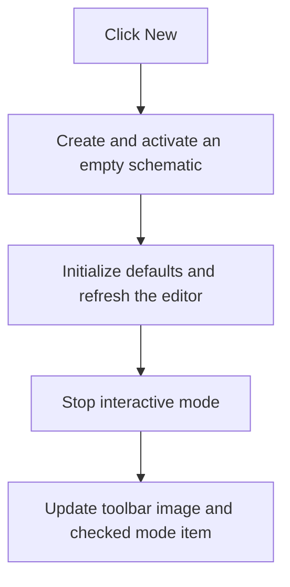

# &New

> Analysis status: Reviewed from recovered new-document construction and editor-mode update paths.

## Control

| Property | Recovered value |
| --- | --- |
| Form | SchematicEditor |
| Component path | SchematicEditor.MainMenu.mnFile.mnNew |
| Control class | TMenuItem |
| Caption | &New |
| Hint | Not present in the recovered resource. |
| Text | Not present in the recovered resource. |
| Handler name | NewSchematicDiagramClick |
| Handler address | 01c75530 |
| Graph node | `resource:dfm:SchematicEditor/SchematicEditor.MainMenu.mnFile.mnNew` |
| Handler node | `function:01c75530` |
| Graph layer | UI |

## What happens when clicked

The handler calls `FUN_01c77470` with the initialization flag set. That worker preserves the current view state, allocates a new empty schematic document, makes it the active document, initializes default component data, refreshes the editor, stops interactive mode, and updates the document list. The old document remains open; this is New, not Close-and-New.

The handler then calls `FUN_01c89690` with the current global editor-mode value. That routine updates the matching toolbar image and the checked menu item. There is no prompt and no local failure branch in the click wrapper.

## Click flow

## Handler evidence

- Source: [DecompiledSources/Tina16/functions/0000000001C75530__FUN_01c75530.c](../../../DecompiledSources/Tina16/functions/0000000001C75530__FUN_01c75530.c)
- Recovered role: Create and activate a new blank schematic document.
- Current graph summary: Handles 1 Delphi UI event: SchematicEditor.MainMenu.mnFile.mnNew.OnClick.
- Current graph behavior: Creates an empty active schematic and then synchronizes the editor-mode controls.
- Current graph evidence: `FUN_01c75530` calls only `FUN_01c77470(Self, 1)` and `FUN_01c89690(Self, global_mode)`. The first worker allocates and activates the document; the second selects the matching toolbar image and checks one of five adjacent menu items.
- Complexity: moderate
- Distinct outgoing calls: 2

## Direct calls

- `function:01c77470` — FUN_01c77470
- `function:01c89690` — FUN_01c89690

## Resource evidence

- Kind: Not present in the recovered resource.
- Modal result: Not present in the recovered resource.
- Checked state: Not present in the recovered resource.
- List items: Not present in the recovered resource.
- Image reference: Not present in the recovered resource.
- Extracted glyph: None.

## Nearby label candidates

Nearby labels are layout candidates only. They are not proof of behavior.

- No same-parent label candidate is available.

## Analysis limits

- The original Delphi names of the document model classes are not recovered.
- Allocation and initialization errors propagate beyond this handler.

