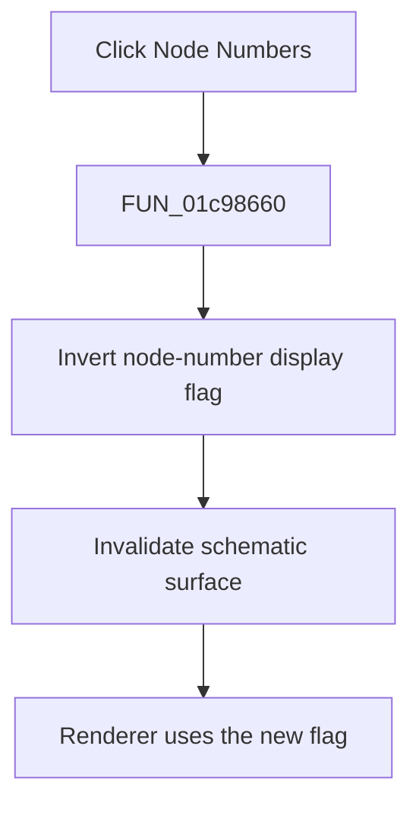

# No&de Numbers

> Analysis status: Complete. The display flag, renderer branch, and repaint call establish the toggle.

## Control

| Property | Recovered value |
| --- | --- |
| Form | SchematicEditor |
| Component path | SchematicEditor.MainMenu.View.mnNodeNumbers |
| Control class | TMenuItem |
| Caption | No&de Numbers |
| Hint | Not present in the recovered resource. |
| Text | Not present in the recovered resource. |
| Handler name | mnNodeNumbersClick |
| Handler address | 01c98660 |
| Graph node | `resource:dfm:SchematicEditor/SchematicEditor.MainMenu.View.mnNodeNumbers` |
| Handler node | `function:01c98660` |
| Graph layer | UI |

## What happens when clicked

`FUN_01c98660` inverts the global byte at `PTR_DAT_02003f60` and invalidates the schematic surface at form offset `0xA10`. The menu-update routine uses this byte as the checked state of `mnNodeNumbers`. The schematic renderer `FUN_0198da60` reads the same byte before its additional drawing path. Thus, the click turns node-number display on or off and schedules a repaint.

## Click flow

## Handler evidence

- Source: [DecompiledSources/Tina16/functions/0000000001C98660__FUN_01c98660.c](../../../DecompiledSources/Tina16/functions/0000000001C98660__FUN_01c98660.c)
- Recovered role: Toggles node-number display and repaints the schematic surface.
- Current graph summary: Handles 1 Delphi UI event: SchematicEditor.MainMenu.View.mnNodeNumbers.OnClick.
- Current graph behavior: Inverts the shared node-number display byte and invalidates the schematic surface.
- Current graph evidence: `FUN_01c98660` toggles `PTR_DAT_02003f60` and calls the recovered invalidate helper for field `0xA10`. `FUN_01c7ec30` copies the byte to this menu item's checked state, and renderer `FUN_0198da60` branches on the same byte.
- Complexity: simple
- Distinct outgoing calls: 1

## Direct calls

- `function:0064e770` — FUN_0064e770

## Resource evidence

- Kind: Not present in the recovered resource.
- Modal result: Not present in the recovered resource.
- Checked state: true
- List items: Not present in the recovered resource.
- Image reference: Not present in the recovered resource.
- Extracted glyph: None.

## Nearby label candidates

Nearby labels are layout candidates only. They are not proof of behavior.

- No same-parent label candidate is available.

## Analysis limits

- The global display byte has no recovered Delphi field name.

