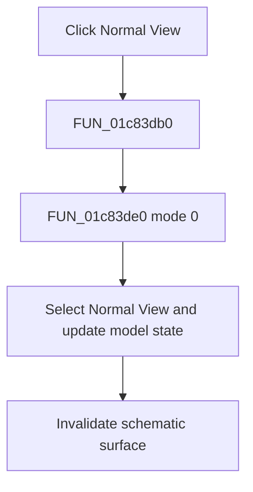

# Normal View

> Analysis status: Complete. The shared view-mode helper establishes the Normal View transition.

## Control

| Property | Recovered value |
| --- | --- |
| Form | SchematicEditor |
| Component path | SchematicEditor.MainMenu.View.mnNormalView |
| Control class | TMenuItem |
| Caption | Normal View |
| Hint | Not present in the recovered resource. |
| Text | Not present in the recovered resource. |
| Handler name | mnNormalViewClick |
| Handler address | 01c83db0 |
| Graph node | `resource:dfm:SchematicEditor/SchematicEditor.MainMenu.View.mnNormalView` |
| Handler node | `function:01c83db0` |
| Graph layer | UI |

## What happens when clicked

`FUN_01c83db0` calls `FUN_01c83de0` with mode 0. The helper checks Normal View, clears Page Layout View, enables the normal-view controls, stores mode 0 in the active schematic model and the shared view-mode byte, refreshes the editor layout, and updates related controls. The handler then invalidates the schematic surface so that it is redrawn in Normal View.

## Click flow

## Handler evidence

- Source: [DecompiledSources/Tina16/functions/0000000001C83DB0__FUN_01c83db0.c](../../../DecompiledSources/Tina16/functions/0000000001C83DB0__FUN_01c83db0.c)
- Recovered role: Switches the schematic editor to Normal View and repaints it.
- Current graph summary: Handles 1 Delphi UI event: SchematicEditor.MainMenu.View.mnNormalView.OnClick.
- Current graph behavior: Applies shared view mode 0, updates menu and model state, refreshes layout state, and invalidates the schematic surface.
- Current graph evidence: The wrapper passes 0 to `FUN_01c83de0`. That helper checks Normal View, clears Page Layout View, writes mode 0 to the model and shared byte, and calls `FUN_0199e510` and `FUN_01c74860`. The wrapper then calls the invalidate helper for field `0xA10`.
- Complexity: moderate
- Distinct outgoing calls: 2

## Direct calls

- `function:0064e770` — FUN_0064e770
- `function:01c83de0` — FUN_01c83de0

## Resource evidence

- Kind: Not present in the recovered resource.
- Modal result: Not present in the recovered resource.
- Checked state: true
- List items: Not present in the recovered resource.
- Image reference: Not present in the recovered resource.
- Extracted glyph: None.

## Nearby label candidates

Nearby labels are layout candidates only. They are not proof of behavior.

- No same-parent label candidate is available.

## Analysis limits

- Two list adjustments inside `FUN_01c83de0` have no recovered Delphi field names; they do not change the proven mode transition.

