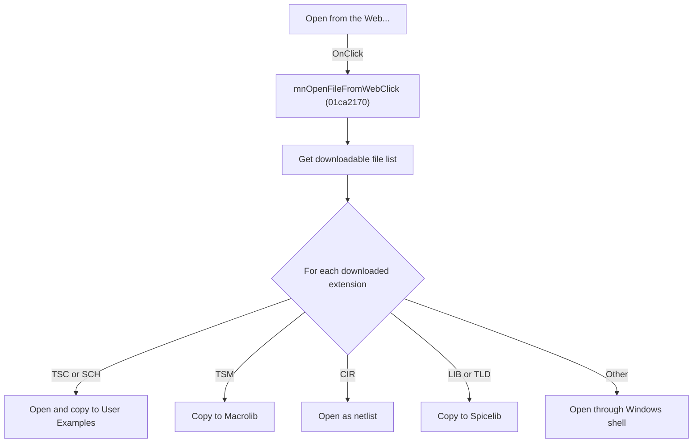

# Open from the Web...

> Analysis status: Individually reviewed.

## Control

| Property | Recovered value |
| --- | --- |
| Form | SchematicEditor |
| Component path | SchematicEditor.MainMenu.mnFile.mnOpenFileFromWeb |
| Control class | TMenuItem |
| Caption | Open from the Web... |
| Hint | Not present in the recovered resource. |
| Text | Not present in the recovered resource. |
| Handler name | mnOpenFileFromWebClick |
| Handler address | 01ca2170 |
| Graph node | `resource:dfm:SchematicEditor/SchematicEditor.MainMenu.mnFile.mnOpenFileFromWeb` |
| Handler node | `function:01ca2170` |
| Graph layer | UI |

## What happens when clicked

The handler obtains a file list from the web service and processes each downloaded file by extension. TSC and SCH files are opened and copied to User Examples, TSM files go to Macrolib, CIR files use the netlist path, LIB and TLD files go to Spicelib, and other types are shell-opened. It reports copy destinations. The menu and toolbar controls share the path.

## Click flow

## Handler evidence

- Source: [DecompiledSources/Tina16/functions/0000000001CA2170__FUN_01ca2170.c](../../../DecompiledSources/Tina16/functions/0000000001CA2170__FUN_01ca2170.c)
- Recovered role: Download and dispatch files from the web.
- Current graph summary: Handles 2 Delphi UI events: SchematicEditor.TopToolBar.GeneralTools.DFOpenFromWebBtn.OnClick, SchematicEditor.MainMenu.mnFile.mnOpenFileFromWeb.OnClick.
- Current graph behavior: The handler obtains a file list from the web service and processes each downloaded file by extension. TSC and SCH files are opened and copied to User Examples, TSM files go to Macrolib, CIR files use the netlist path, LIB and TLD files go to Spicelib, and other types are shell-opened. It reports copy destinations. The menu and toolbar controls share the path.
- Current graph evidence: The recovered body contains the web-list call, file loop, explicit extension comparisons for .TSC, .SCH, .TSM, .CIR, .LIB, and .TLD, directory-copy helpers, schematic and netlist dispatches, shell-open fallback, and destination messages.
- Complexity: complex
- Distinct outgoing calls: 22

## Direct calls

- `function:00410f20` — Nil-safe Delphi object destruction helper
- `function:00414480` — Delphi UnicodeString clear and finalization helper
- `function:00414560` — Delphi UnicodeString array finalization helper
- `function:00414b50` — FUN_00414b50
- `function:00416740` — FUN_00416740
- `function:00416ad0` — FUN_00416ad0
- `function:00416ba0` — FUN_00416ba0
- `function:00416cd0` — FUN_00416cd0
- `function:0043e420` — FUN_0043e420
- `function:00441920` — FUN_00441920
- `function:00441a10` — FUN_00441a10
- `function:00442f70` — FUN_00442f70
- `function:00450070` — FUN_00450070
- `function:004b6930` — FUN_004b6930
- `function:00724270` — FUN_00724270
- `function:014a1260` — FUN_014a1260
- `function:01530bb0` — FUN_01530bb0
- `function:01542950` — FUN_01542950
- `function:0199e310` — FUN_0199e310
- `function:01c1de60` — FUN_01c1de60
- `function:01c681b0` — FUN_01c681b0
- `function:01c806a0` — Handles 1 Delphi UI event: SchematicEditor.MainMenu.mnTools.mnSPiceEditor.OnClick.

## Resource evidence

- Kind: Not present in the recovered resource.
- Modal result: Not present in the recovered resource.
- Checked state: Not present in the recovered resource.
- List items: Not present in the recovered resource.
- Image reference: Not present in the recovered resource.
- Extracted glyph: None.

## Nearby label candidates

Nearby labels are layout candidates only. They are not proof of behavior.

- No same-parent label candidate is available.

## Analysis limits

- Network transport and authentication behavior are implemented in the downstream web service helper.

