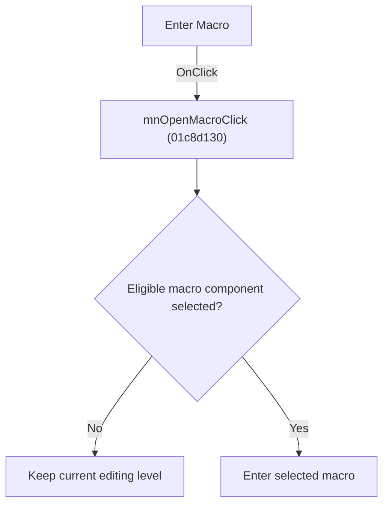

# Enter Macro

> Analysis status: Individually reviewed.

## Control

| Property | Recovered value |
| --- | --- |
| Form | SchematicEditor |
| Component path | SchematicEditor.MainMenu.mnFile.mnOpenMacro |
| Control class | TMenuItem |
| Caption | Enter Macro |
| Hint | Not present in the recovered resource. |
| Text | Not present in the recovered resource. |
| Handler name | mnOpenMacroClick |
| Handler address | 01c8d130 |
| Graph node | `resource:dfm:SchematicEditor/SchematicEditor.MainMenu.mnFile.mnOpenMacro` |
| Handler node | `function:01c8d130` |
| Graph layer | UI |

## What happens when clicked

The handler enters a macro only when the selected object is a compatible and eligible component. With no qualifying selection it returns without changing the editing level. Sender is unused.

## Click flow

## Handler evidence

- Source: [DecompiledSources/Tina16/functions/0000000001C8D130__FUN_01c8d130.c](../../../DecompiledSources/Tina16/functions/0000000001C8D130__FUN_01c8d130.c)
- Recovered role: Enter the selected macro.
- Current graph summary: Handles 2 Delphi UI events: SchematicEditor.MainMenu.mnFile.mnOpenMacro.OnClick, SchematicEditor.SchPopup.pmOpenMacro.OnClick.
- Current graph behavior: The handler enters a macro only when the selected object is a compatible and eligible component. With no qualifying selection it returns without changing the editing level. Sender is unused.
- Current graph evidence: The recovered body checks the selected-object pointer, class and eligibility fields, then calls the macro-entry helper. The menu and popup captions both say Enter Macro.
- Complexity: complex
- Distinct outgoing calls: 4

## Direct calls

- `function:0198a580` — FUN_0198a580
- `function:01993ec0` — FUN_01993ec0
- `function:01c8c8f0` — FUN_01c8c8f0
- `function:01d04d40` — FUN_01d04d40

## Resource evidence

- Kind: Not present in the recovered resource.
- Modal result: Not present in the recovered resource.
- Checked state: Not present in the recovered resource.
- List items: Not present in the recovered resource.
- Image reference: Not present in the recovered resource.
- Extracted glyph: None.

## Nearby label candidates

Nearby labels are layout candidates only. They are not proof of behavior.

- No same-parent label candidate is available.

## Analysis limits

- The eligible component class is not named in the recovered symbols.

