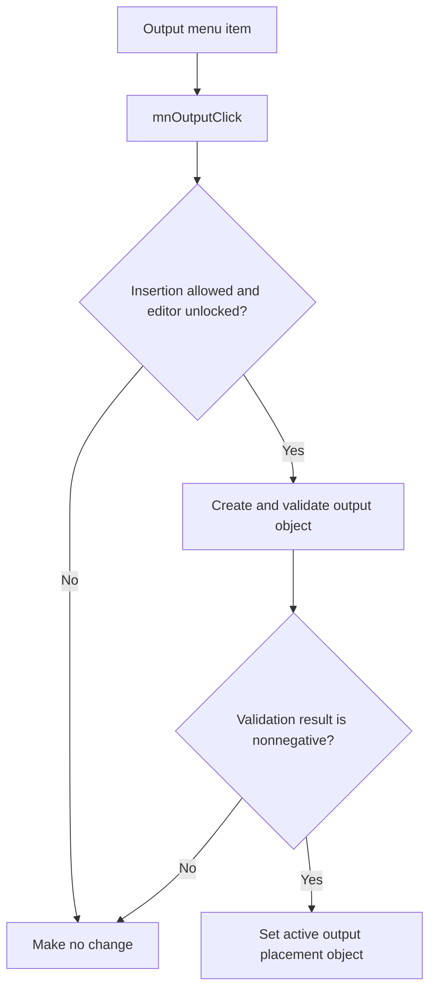

# &Output

> Analysis status: Reviewed with recovered validation and insertion-state evidence.

## Control

| Property | Recovered value |
| --- | --- |
| Component path | `SchematicEditor.MainMenu.Insert.mnOutput` |
| Control class | `TMenuItem` |
| Handler | `mnOutputClick` at `01c77410` |

## What happens when clicked

The command does nothing when the editor blocks insertion or the global edit lock is active. Otherwise, it constructs and validates the output placement object. A negative validation result leaves the active insertion object unchanged. A valid result replaces the previous active insertion object and stages output placement.

## Click flow

## Evidence

- [Handler source](../../../DecompiledSources/Tina16/functions/0000000001C77410__FUN_01c77410.c) checks both guards and the constructor's validation field before it stores the object.
- [Placement-object constructor](../../../DecompiledSources/Tina16/functions/00000000013699B0__FUN_013699b0.c) calls object validation and stores its result at offset `0x2c`.

## Analysis limits

- The recovered validation result does not identify each possible failure reason.
