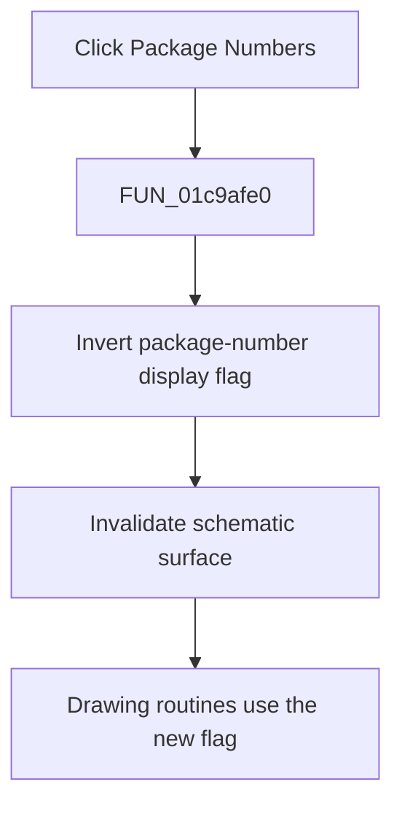

# Package Numbers

> Analysis status: Complete. The display flag readers and repaint call establish the toggle.

## Control

| Property | Recovered value |
| --- | --- |
| Form | SchematicEditor |
| Component path | SchematicEditor.MainMenu.View.mnPackageNumbers |
| Control class | TMenuItem |
| Caption | Package Numbers |
| Hint | Not present in the recovered resource. |
| Text | Not present in the recovered resource. |
| Handler name | mnPackageNumbersClick |
| Handler address | 01c9afe0 |
| Graph node | `resource:dfm:SchematicEditor/SchematicEditor.MainMenu.View.mnPackageNumbers` |
| Handler node | `function:01c9afe0` |
| Graph layer | UI |

## What happens when clicked

`FUN_01c9afe0` inverts the global byte at `PTR_DAT_02003038` and invalidates the schematic surface at form offset `0xA10`. The menu-update routine copies this byte to the checked state of `mnPackageNumbers`. Drawing routines `FUN_01d037f0` and `FUN_01d04360` branch on the same byte while they render package-related data. Thus, the click turns package-number display on or off and schedules a repaint.

## Click flow

## Handler evidence

- Source: [DecompiledSources/Tina16/functions/0000000001C9AFE0__FUN_01c9afe0.c](../../../DecompiledSources/Tina16/functions/0000000001C9AFE0__FUN_01c9afe0.c)
- Recovered role: Toggles package-number display and repaints the schematic surface.
- Current graph summary: Handles 1 Delphi UI event: SchematicEditor.MainMenu.View.mnPackageNumbers.OnClick.
- Current graph behavior: Inverts the package-number display byte and invalidates the schematic surface.
- Current graph evidence: `FUN_01c9afe0` toggles `PTR_DAT_02003038` and calls the invalidate helper. `FUN_01c7ec30` uses the byte as this menu item's checked state. `FUN_01d037f0` and `FUN_01d04360` use it in drawing branches.
- Complexity: simple
- Distinct outgoing calls: 1

## Direct calls

- `function:0064e770` — FUN_0064e770

## Resource evidence

- Kind: Not present in the recovered resource.
- Modal result: Not present in the recovered resource.
- Checked state: true
- List items: Not present in the recovered resource.
- Image reference: Not present in the recovered resource.
- Extracted glyph: None.

## Nearby label candidates

Nearby labels are layout candidates only. They are not proof of behavior.

- No same-parent label candidate is available.

## Analysis limits

- The global display byte has no recovered Delphi field name.

