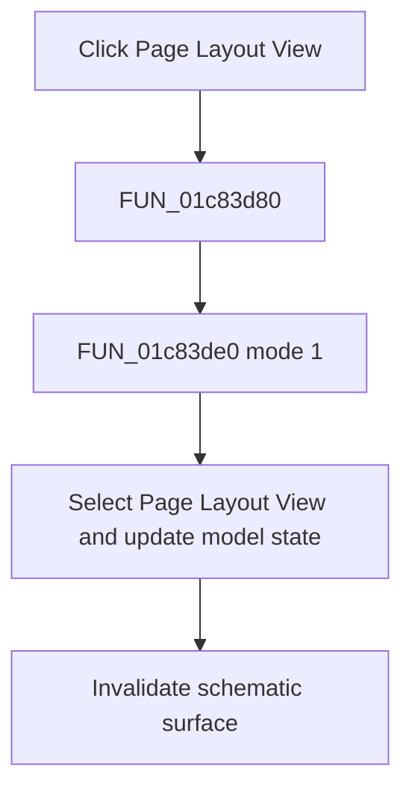

# Page Layout View

> Analysis status: Complete. The shared view-mode helper establishes the Page Layout View transition.

## Control

| Property | Recovered value |
| --- | --- |
| Form | SchematicEditor |
| Component path | SchematicEditor.MainMenu.View.mnPageLayoutView |
| Control class | TMenuItem |
| Caption | Page Layout View |
| Hint | Not present in the recovered resource. |
| Text | Not present in the recovered resource. |
| Handler name | mnPageLayoutViewClick |
| Handler address | 01c83d80 |
| Graph node | `resource:dfm:SchematicEditor/SchematicEditor.MainMenu.View.mnPageLayoutView` |
| Handler node | `function:01c83d80` |
| Graph layer | UI |

## What happens when clicked

`FUN_01c83d80` calls `FUN_01c83de0` with mode 1. The helper checks Page Layout View, clears Normal View, disables controls that are not available in page-layout mode, stores mode 1 in the active schematic model and the shared view-mode byte, refreshes the editor layout, and updates related controls. The handler then invalidates the schematic surface so that it is redrawn in Page Layout View.

## Click flow

## Handler evidence

- Source: [DecompiledSources/Tina16/functions/0000000001C83D80__FUN_01c83d80.c](../../../DecompiledSources/Tina16/functions/0000000001C83D80__FUN_01c83d80.c)
- Recovered role: Switches the schematic editor to Page Layout View and repaints it.
- Current graph summary: Handles 1 Delphi UI event: SchematicEditor.MainMenu.View.mnPageLayoutView.OnClick.
- Current graph behavior: Applies shared view mode 1, updates menu and model state, refreshes layout state, and invalidates the schematic surface.
- Current graph evidence: The wrapper passes 1 to `FUN_01c83de0`. That helper checks Page Layout View, clears Normal View, writes mode 1 to the model and shared byte, and calls `FUN_0199e510` and `FUN_01c74860`. The wrapper then calls the invalidate helper for field `0xA10`.
- Complexity: moderate
- Distinct outgoing calls: 2

## Direct calls

- `function:0064e770` — FUN_0064e770
- `function:01c83de0` — FUN_01c83de0

## Resource evidence

- Kind: Not present in the recovered resource.
- Modal result: Not present in the recovered resource.
- Checked state: Not present in the recovered resource.
- List items: Not present in the recovered resource.
- Image reference: Not present in the recovered resource.
- Extracted glyph: None.

## Nearby label candidates

Nearby labels are layout candidates only. They are not proof of behavior.

- No same-parent label candidate is available.

## Analysis limits

- List-management fields inside `FUN_01c83de0` have no recovered Delphi names; they do not change the proven mode transition.

