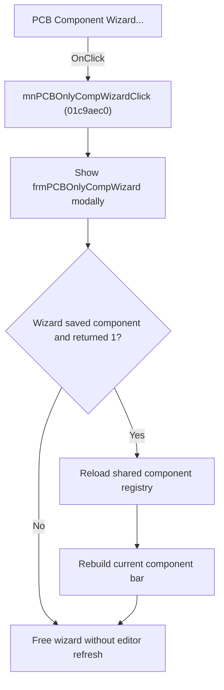

# PCB Component Wizard...

> Analysis status: Source, graph, wizard, and library-refresh evidence reviewed.

## Control

| Property | Recovered value |
| --- | --- |
| Form | SchematicEditor |
| Component path | SchematicEditor.MainMenu.mnTools.mnPCBTools.mnPCBOnlyCompWizard |
| Control class | TMenuItem |
| Caption | PCB Component Wizard... |
| Hint | Not present in the recovered resource. |
| Text | Not present in the recovered resource. |
| Handler name | mnPCBOnlyCompWizardClick |
| Handler address | 01c9aec0 |
| Graph node | `resource:dfm:SchematicEditor/SchematicEditor.MainMenu.mnTools.mnPCBTools.mnPCBOnlyCompWizard` |
| Handler node | `function:01c9aec0` |
| Graph layer | UI |

## What happens when clicked

The command creates `frmPCBOnlyCompWizard`, whose caption is `PCB Component Wizard`, and shows it modally. The wizard collects the component name, group, shape, icon, and target library. Its OK path opens a Save dialog for a `.tsm` macro, creates a type-`0x39` component payload, writes the macro, and updates the selected library entry.

If the modal result is `1`, the outer handler refreshes the Schematic Editor client, reloads the shared component registry, and rebuilds the current component bar. Cancel or a wizard path that does not complete the save skips these refresh operations. The outer handler then frees the wizard.

## Click flow

## Handler evidence

- Source: [DecompiledSources/Tina16/functions/0000000001C9AEC0__FUN_01c9aec0.c](../../../DecompiledSources/Tina16/functions/0000000001C9AEC0__FUN_01c9aec0.c)
- Recovered role: Runs the PCB Component Wizard and reloads component bars after a saved component.
- Current graph summary: Shows `frmPCBOnlyCompWizard` modally and, for result `1`, reloads the shared registry and active component bar.
- Current graph behavior: Cancel and incomplete save paths do not refresh the editor. Both outer paths free the temporary wizard.
- Current graph evidence: The class at `PTR_FUN_01bc1898` maps to `TfrmPCBOnlyCompWizard`. Its `btnOKClick` builds a `.tsm` path, executes its Save dialog, creates component type `0x39`, writes the macro payload, and sets form field `+0x508` to `1`. The outer handler tests modal result `1`, calls the registry refresh helpers, and calls `FUN_01c691d0` to rebuild the active component bar.
- Complexity: complex
- Distinct outgoing calls: 6

## Direct calls

- `function:00410f20` — Nil-safe Delphi object destruction helper
- `function:007fc180` — FUN_007fc180
- `function:008088b0` — FUN_008088b0
- `function:00c82c10` — FUN_00c82c10
- `function:00c85140` — FUN_00c85140
- `function:01c691d0` — FUN_01c691d0

## Resource evidence

- Kind: Not present in the recovered resource.
- Modal result: Not present in the recovered resource.
- Checked state: Not present in the recovered resource.
- List items: Not present in the recovered resource.
- Image reference: Not present in the recovered resource.
- Extracted glyph: None.

## Nearby label candidates

Nearby labels are layout candidates only. They are not proof of behavior.

- No same-parent label candidate is available.

## Analysis limits

- File-write errors inside the macro writer do not return a separate status to the outer handler.
- The current category code at editor offset `0x1810` does not have a recovered Delphi field name.

