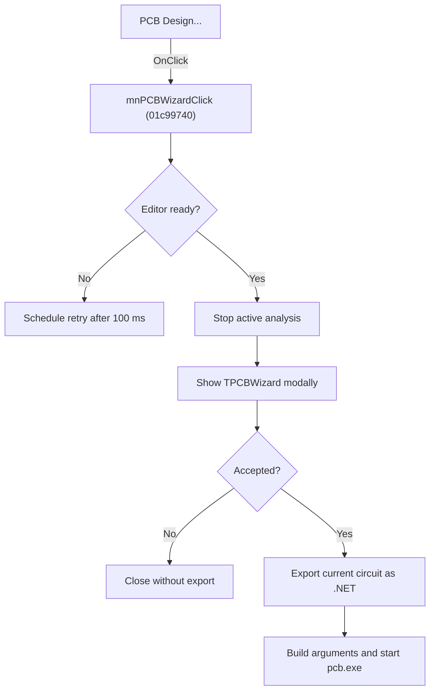

# PCB Design...

> Analysis status: Source, graph, wizard, export, and launch evidence reviewed.

## Control

| Property | Recovered value |
| --- | --- |
| Form | SchematicEditor |
| Component path | SchematicEditor.MainMenu.mnTools.mnPCBTools.mnPCBWizard |
| Control class | TMenuItem |
| Caption | PCB Design... |
| Hint | Not present in the recovered resource. |
| Text | Not present in the recovered resource. |
| Handler name | mnPCBWizardClick |
| Handler address | 01c99740 |
| Graph node | `resource:dfm:SchematicEditor/SchematicEditor.MainMenu.mnTools.mnPCBTools.mnPCBWizard` |
| Handler node | `function:01c99740` |
| Graph layer | UI |

## What happens when clicked

The command enters the shared PCB Design path. If the Schematic Editor is busy, it clears the pressed tool state and schedules the same command to run again after 100 ms. When the editor is ready, it stops the active analysis and opens `TPCBWizard` modally.

If the wizard is accepted, the handler exports the current circuit as a `.NET` netlist, builds the PCB command arguments and `.HID` path from the wizard selections, and starts `pcb.exe` in the application directory. Cancel closes the wizard without an export or process launch.

## Click flow

## Handler evidence

- Source: [DecompiledSources/Tina16/functions/0000000001C99740__FUN_01c99740.c](../../../DecompiledSources/Tina16/functions/0000000001C99740__FUN_01c99740.c)
- Recovered role: Opens PCB Design and launches the external PCB application for an accepted wizard configuration.
- Current graph summary: Delegates to the PCB toolbar's shared command path.
- Current graph behavior: Defers while the editor is busy, stops analysis, collects PCB options, exports a netlist, and launches `pcb.exe` only after acceptance.
- Current graph evidence: `FUN_01c99740` calls shared handler `FUN_01c99370`. That handler uses `FUN_01c87d20` for readiness, schedules itself with delay `100` when not ready, calls the analysis-stop path, shows `TPCBWizard`, tests modal result `1`, calls `FUN_01b41bc0` for the `.NET` export, constructs the `.HID` and command strings, and passes `pcb.exe` to `FUN_01d44af0` with the application directory.
- Complexity: simple
- Distinct outgoing calls: 1

## Direct calls

- `function:01c99370` — Handles 1 Delphi UI event: SchematicEditor.TopToolBar.EditorTools.sbStartPCBDesigner.OnClick.

## Resource evidence

- Kind: Not present in the recovered resource.
- Modal result: Not present in the recovered resource.
- Checked state: Not present in the recovered resource.
- List items: Not present in the recovered resource.
- Image reference: Not present in the recovered resource.
- Extracted glyph: None.

## Nearby label candidates

Nearby labels are layout candidates only. They are not proof of behavior.

- No same-parent label candidate is available.

## Analysis limits

- The recovered source does not assign names to all PCB wizard command switches.
- The handler starts the external process but does not wait for or check its exit result.

