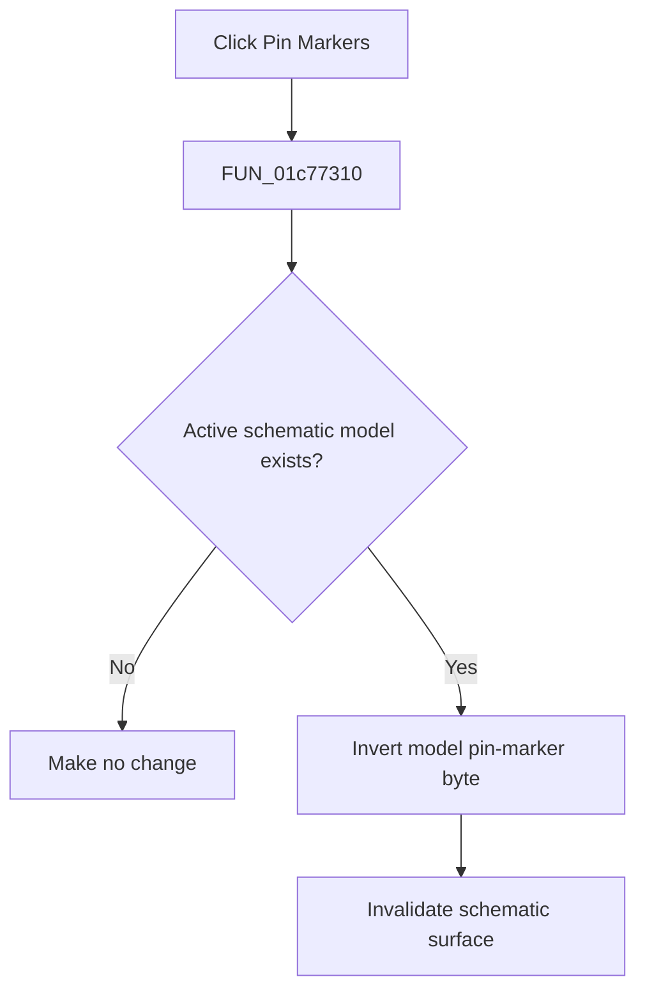

# Pin &Markers

> Analysis status: Complete. The shared model-state helper and repaint call establish the toggle.

## Control

| Property | Recovered value |
| --- | --- |
| Form | SchematicEditor |
| Component path | SchematicEditor.MainMenu.View.mnPinMarkers |
| Control class | TMenuItem |
| Caption | Pin &Markers |
| Hint | Not present in the recovered resource. |
| Text | Not present in the recovered resource. |
| Handler name | mnPinMarkersClick |
| Handler address | 01c77310 |
| Graph node | `resource:dfm:SchematicEditor/SchematicEditor.MainMenu.View.mnPinMarkers` |
| Handler node | `function:01c77310` |
| Graph layer | UI |

## What happens when clicked

`FUN_01c77310` delegates to `FUN_01c6d590`. When an active schematic model exists, the helper resolves the model object, inverts its byte at offset `0x12B`, and invalidates the schematic surface at form offset `0xA10`. The menu item is recovered as checked. Thus, the command turns pin markers on or off for the active schematic and repaints it. If there is no active model, the helper makes no change.

## Click flow

## Handler evidence

- Source: [DecompiledSources/Tina16/functions/0000000001C77310__FUN_01c77310.c](../../../DecompiledSources/Tina16/functions/0000000001C77310__FUN_01c77310.c)
- Recovered role: Toggles pin markers for the active schematic and repaints it.
- Current graph summary: Handles 1 Delphi UI event: SchematicEditor.MainMenu.View.mnPinMarkers.OnClick.
- Current graph behavior: Calls the shared helper, which inverts the active model byte at `0x12B` and invalidates the schematic surface.
- Current graph evidence: The DFM caption is `Pin Markers`. `FUN_01c77310` calls `FUN_01c6d590`; the helper checks for an active model, resolves it through `FUN_0198d430`, toggles byte `0x12B`, and calls the invalidate helper for field `0xA10`.
- Complexity: simple
- Distinct outgoing calls: 1

## Direct calls

- `function:01c6d590` — FUN_01c6d590

## Resource evidence

- Kind: Not present in the recovered resource.
- Modal result: Not present in the recovered resource.
- Checked state: true
- List items: Not present in the recovered resource.
- Image reference: Not present in the recovered resource.
- Extracted glyph: None.

## Nearby label candidates

Nearby labels are layout candidates only. They are not proof of behavior.

- No same-parent label candidate is available.

## Analysis limits

- The model byte at offset `0x12B` has no recovered Delphi field name.

