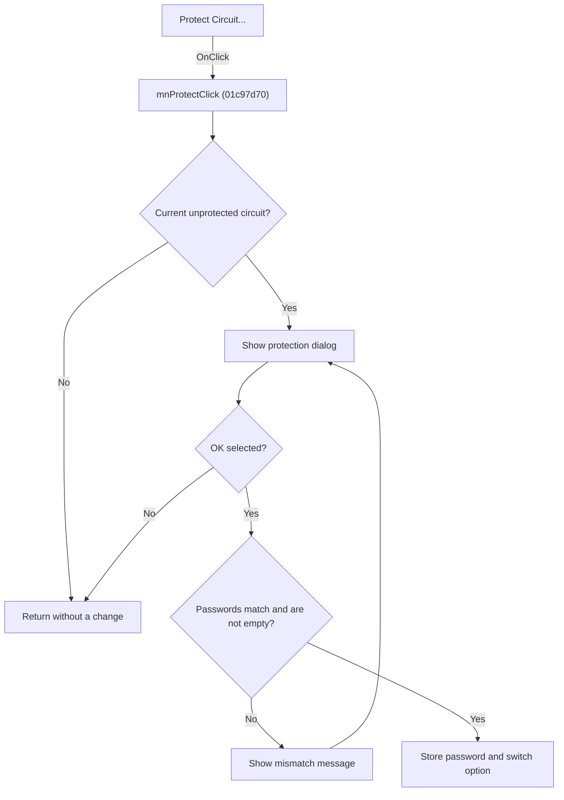

# Pro&tect Circuit...

> Analysis status: Source, graph, dialog-resource, validation, and circuit-state evidence reviewed.

## Control

| Property | Recovered value |
| --- | --- |
| Form | SchematicEditor |
| Component path | SchematicEditor.MainMenu.mnTools.mnProtect |
| Control class | TMenuItem |
| Caption | Pro&tect Circuit... |
| Hint | Not present in the recovered resource. |
| Text | Not present in the recovered resource. |
| Handler name | mnProtectClick |
| Handler address | 01c97d70 |
| Graph node | `resource:dfm:SchematicEditor/SchematicEditor.MainMenu.mnTools.mnProtect` |
| Handler node | `function:01c97d70` |
| Graph layer | UI |

## What happens when clicked

The command does nothing if there is no current circuit or if that circuit is already protected. Otherwise, it opens `TProtectCircDlg`. The dialog asks for the password twice and includes the `Allow switching between good && faulty` option.

Cancel leaves the circuit unchanged. On OK, an empty password or two different passwords produces `The passwords do not match. Please try again.` under the `Protect Circuit` title and opens the dialog again. A valid matching password is stored in the circuit, and the option state is stored with the protection data.

## Click flow

## Handler evidence

- Source: [DecompiledSources/Tina16/functions/0000000001C97D70__FUN_01c97d70.c](../../../DecompiledSources/Tina16/functions/0000000001C97D70__FUN_01c97d70.c)
- Recovered role: Validates and stores protection settings for the current circuit.
- Current graph summary: Skips missing or already protected circuits, then loops the modal protection dialog until cancel or valid input.
- Current graph behavior: Stores a matching non-empty password and the allow-switch option. Cancel and ineligible circuit states do not change protection data.
- Current graph evidence: `FUN_019ac250` tests existing protection. The DFM for `TProtectCircDlg` identifies the two password fields and the allow-switch check box. `FUN_01c97d70` compares the two Unicode strings and rejects both mismatch and empty input with the recovered message. A valid result calls `FUN_019ac180` with the password and `FUN_019ac120` with the check-box state.
- Complexity: complex
- Distinct outgoing calls: 11

## Direct calls

- `function:00410f20` — Nil-safe Delphi object destruction helper
- `function:00414480` — Delphi UnicodeString clear and finalization helper
- `function:00414560` — Delphi UnicodeString array finalization helper
- `function:00416db0` — FUN_00416db0
- `function:0043ea00` — FUN_0043ea00
- `function:0064dd90` — VCL control Unicode text reader
- `function:007fc180` — FUN_007fc180
- `function:0080d2f0` — FUN_0080d2f0
- `function:019ac120` — FUN_019ac120
- `function:019ac180` — FUN_019ac180
- `function:019ac250` — FUN_019ac250

## Resource evidence

- Kind: Not present in the recovered resource.
- Modal result: Not present in the recovered resource.
- Checked state: Not present in the recovered resource.
- List items: Not present in the recovered resource.
- Image reference: Not present in the recovered resource.
- Extracted glyph: None.

## Nearby label candidates

Nearby labels are layout candidates only. They are not proof of behavior.

- No same-parent label candidate is available.

## Analysis limits

- The recovered handler does not send a separate model-change notification after it stores protection data.
- The internal circuit field names remain unresolved.

