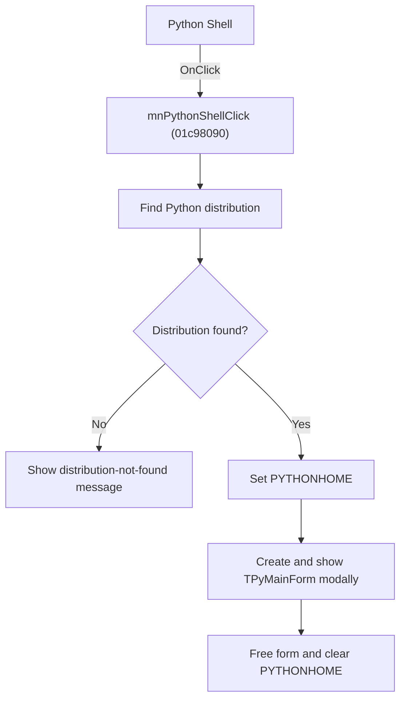

# Python Shell

> Analysis status: Source, graph, Python-discovery, environment, and form evidence reviewed.

## Control

| Property | Recovered value |
| --- | --- |
| Form | SchematicEditor |
| Component path | SchematicEditor.MainMenu.mnTools.mnPythonShell |
| Control class | TMenuItem |
| Caption | Python Shell |
| Hint | Not present in the recovered resource. |
| Text | Not present in the recovered resource. |
| Handler name | mnPythonShellClick |
| Handler address | 01c98090 |
| Graph node | `resource:dfm:SchematicEditor/SchematicEditor.MainMenu.mnTools.mnPythonShell` |
| Handler node | `function:01c98090` |
| Graph layer | UI |

## What happens when clicked

The command calls the shared Python Shell launcher. The launcher first searches for the installed Python distribution. If it cannot find one, it shows `Python distribution not found!` and does not create the shell.

If Python is available, the launcher sets `PYTHONHOME`, creates and initializes `TPyMainForm`, and shows it modally. When the form closes, it frees the temporary form and clears `PYTHONHOME`. A new form is created for each command invocation.

## Click flow

## Handler evidence

- Source: [DecompiledSources/Tina16/functions/0000000001C98090__FUN_01c98090.c](../../../DecompiledSources/Tina16/functions/0000000001C98090__FUN_01c98090.c)
- Recovered role: Opens the modal Python Shell when the Python distribution is available.
- Current graph summary: Delegates to `FUN_0146ecf0` with the standard launch mode.
- Current graph behavior: Reports a missing distribution, or temporarily configures `PYTHONHOME`, runs the shell form, and restores the environment afterward.
- Current graph evidence: `FUN_01c98090` calls `FUN_0146ecf0(0,0)`. The callee runs the recovered Python-discovery path, contains the exact missing-distribution message, sets the `PYTHONHOME` environment variable, constructs `TPyMainForm`, initializes and shows it modally, then destroys the form and clears the variable.
- Complexity: moderate
- Distinct outgoing calls: 2

## Direct calls

- `function:00414480` — Delphi UnicodeString clear and finalization helper
- `function:0146ecf0` — FUN_0146ecf0

## Resource evidence

- Kind: Not present in the recovered resource.
- Modal result: Not present in the recovered resource.
- Checked state: Not present in the recovered resource.
- List items: Not present in the recovered resource.
- Image reference: Not present in the recovered resource.
- Extracted glyph: None.

## Nearby label candidates

Nearby labels are layout candidates only. They are not proof of behavior.

- No same-parent label candidate is available.

## Analysis limits

- The recovered source does not expose the exact distribution search order as Delphi names.
- Python commands that the user runs inside the shell belong to the form's event handlers, not this menu handler.

