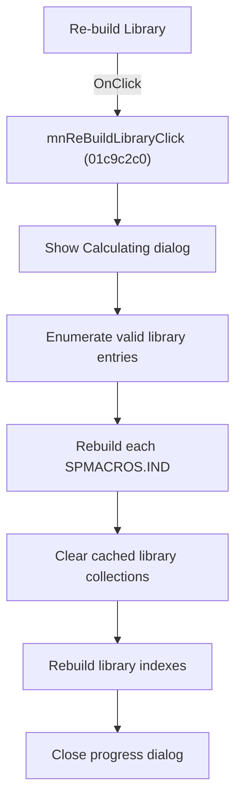

# Re-&build Library

> Analysis status: Source, graph, library-enumeration, index-rebuild, and progress-dialog evidence reviewed.

## Control

| Property | Recovered value |
| --- | --- |
| Form | SchematicEditor |
| Component path | SchematicEditor.MainMenu.mnTools.mnReBuildLibrary |
| Control class | TMenuItem |
| Caption | Re-&build Library |
| Hint | Not present in the recovered resource. |
| Text | Not present in the recovered resource. |
| Handler name | mnReBuildLibraryClick |
| Handler address | 01c9c2c0 |
| Graph node | `resource:dfm:SchematicEditor/SchematicEditor.MainMenu.mnTools.mnReBuildLibrary` |
| Handler node | `function:01c9c2c0` |
| Graph layer | UI |

## What happens when clicked

The command starts the shared library rebuild in full-library mode. It opens `TMessageBoxDlg` with the caption `Calculating`, enumerates every valid library category and entry, and rebuilds each entry's `SPMACROS.IND` data through the per-entry rebuild path.

After the enumeration, it clears 18 cached library collections and rebuilds the library indexes. It then closes the progress dialog. The handler does not return a completion count or a separate error status.

## Click flow

## Handler evidence

- Source: [DecompiledSources/Tina16/functions/0000000001C9C2C0__FUN_01c9c2c0.c](../../../DecompiledSources/Tina16/functions/0000000001C9C2C0__FUN_01c9c2c0.c)
- Recovered role: Rebuilds all schematic component library entries and their indexes.
- Current graph summary: Calls the shared library operation in mode `3` with progress enabled.
- Current graph behavior: Rebuilds each valid entry, clears cached collections, and reconstructs the library indexes before the progress dialog closes.
- Current graph evidence: `FUN_01c9c2c0` calls `FUN_01716680(editor+0x2520,1,3)`. In mode `3`, that callee constructs `TMessageBoxDlg`, enumerates the library categories and entries, and calls `FUN_017115e0(entry,1)`. The per-entry function replaces the `SPMACROS.IND` data and refreshes the item. The caller then invokes `FUN_01719a40` to clear 18 collections and `FUN_01719d10` to rebuild their indexes.
- Complexity: simple
- Distinct outgoing calls: 1

## Direct calls

- `function:01716680` — FUN_01716680

## Resource evidence

- Kind: Not present in the recovered resource.
- Modal result: Not present in the recovered resource.
- Checked state: Not present in the recovered resource.
- List items: Not present in the recovered resource.
- Image reference: Not present in the recovered resource.
- Extracted glyph: None.

## Nearby label candidates

Nearby labels are layout candidates only. They are not proof of behavior.

- No same-parent label candidate is available.

## Analysis limits

- The recovered operation does not return per-entry success details to this menu handler.
- The Delphi names of the 18 cached collections are not recovered.

