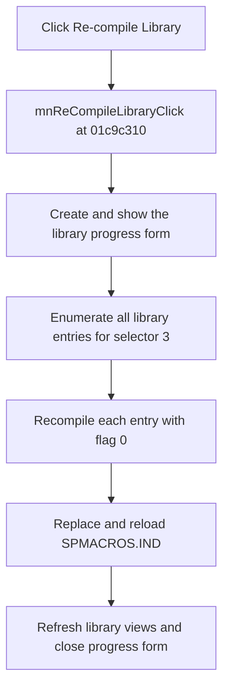

# Re-c&ompile Library

> Analysis status: Complete.

## Control

| Property | Recovered value |
| --- | --- |
| Form | SchematicEditor |
| Component path | SchematicEditor.MainMenu.mnTools.mnReCompileLibrary |
| Control class | TMenuItem |
| Caption | Re-c&ompile Library |
| Handler | `mnReCompileLibraryClick` at `01c9c310` |
| Graph nodes | `resource:dfm:SchematicEditor/SchematicEditor.MainMenu.mnTools.mnReCompileLibrary` → `function:01c9c310` |
| Graph layer | UI |

## What happens when clicked

The handler passes the Schematic Editor library manager at form offset `+0x2520` to `FUN_01716680`. It supplies operation selector `3` and rebuild flag `0`.

`FUN_01716680` creates and shows the library progress form, enumerates every entry selected by operation `3`, and calls `FUN_017115e0` for each entry. That callee rebuilds the entry's `SPMACROS.IND` file from its source and destination directories, reloads the index, and releases temporary objects. The shared helper then refreshes its library views and destroys the progress form. The parallel Re-build Library handler uses the same path with flag `1`; this control uses flag `0` for the recompile variant.

The click has no local validation, retry, message, or exception handler. An empty enumeration still opens and closes the progress form and runs the final library refresh.

## Click flow

## Evidence

- Handler: [FUN_01c9c310](../../../DecompiledSources/Tina16/functions/0000000001C9C310__FUN_01c9c310.c)
- Library operation: [FUN_01716680](../../../DecompiledSources/Tina16/functions/0000000001716680__FUN_01716680.c)
- Entry compiler: [FUN_017115e0](../../../DecompiledSources/Tina16/functions/00000000017115E0__FUN_017115e0.c)
- Parallel Re-build handler: [FUN_01c9c2c0](../../../DecompiledSources/Tina16/functions/0000000001C9C2C0__FUN_01c9c2c0.c)
- Recovered role: Recompile all library entries and refresh the library indexes.
- No image or glyph is present for this menu item.

## Analysis limits

- The recovered field names for the library manager and progress-form global are not available. Their enumeration, index-file, refresh, and parallel-control data flow establishes their roles.
