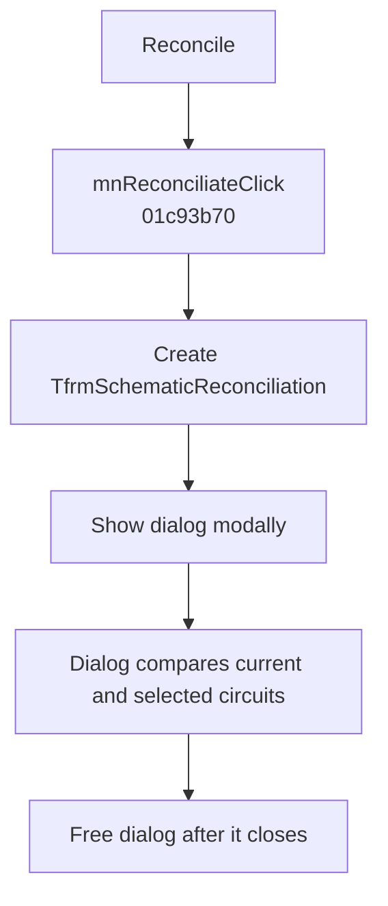

# Reconcile...

> Analysis status: Evidence-backed behavior recovered.

## Control

| Property | Recovered value |
| --- | --- |
| Form | SchematicEditor |
| Component path | SchematicEditor.MainMenu.Edit.Sharing1.mnReconciliate |
| Control class | TMenuItem |
| Caption | Reconcile... |
| Hint | Not present in the recovered resource. |
| Text | Not present in the recovered resource. |
| Handler name | mnReconciliateClick |
| Handler address | 01c93b70 |
| Graph node | `resource:dfm:SchematicEditor/SchematicEditor.MainMenu.Edit.Sharing1.mnReconciliate` |
| Handler node | `function:01c93b70` |
| Graph layer | UI |

## What happens when clicked

The handler creates the Delphi form at class pointer `PTR_FUN_01B9E928`, shows it modally through virtual method `0x2D0`, and frees it. The pointer's published methods match `TfrmSchematicReconciliation`. Its resource is titled “Schematic Reconciliation” and shows lists for blocks in the current and selected circuits. The dialog owns the copy and acceptance operations. This menu handler does not inspect the modal result and does not apply a second state change after the dialog closes.

## Click flow

## Handler evidence

- Source: [DecompiledSources/Tina16/functions/0000000001C93B70__FUN_01c93b70.c](../../../DecompiledSources/Tina16/functions/0000000001C93B70__FUN_01c93b70.c)
- Recovered role: Opens the modal schematic reconciliation dialog.
- Current graph summary: Handles 1 Delphi UI event: SchematicEditor.MainMenu.Edit.Sharing1.mnReconciliate.OnClick.
- Current graph behavior: The handler creates, shows, and frees `TfrmSchematicReconciliation`; all reconciliation decisions stay in that dialog.
- Current graph evidence: The constructor uses `PTR_FUN_01B9E928`; the recovered form methods share that class table and the DFM identifies its current-circuit and selected-circuit lists.
- Complexity: moderate
- Distinct outgoing calls: 2

## Direct calls

- `function:00410f20` — Nil-safe Delphi object destruction helper
- `function:007fc180` — FUN_007fc180

## Resource evidence

- Kind: Not present in the recovered resource.
- Modal result: Not present in the recovered resource.
- Checked state: Not present in the recovered resource.
- List items: Not present in the recovered resource.
- Image reference: Not present in the recovered resource.
- Extracted glyph: None.

## Nearby label candidates

Nearby labels are layout candidates only. They are not proof of behavior.

- No same-parent label candidate is available.

## Analysis limits

- The menu handler does not expose which rows the user copies. Those decisions are made inside the modal dialog.

