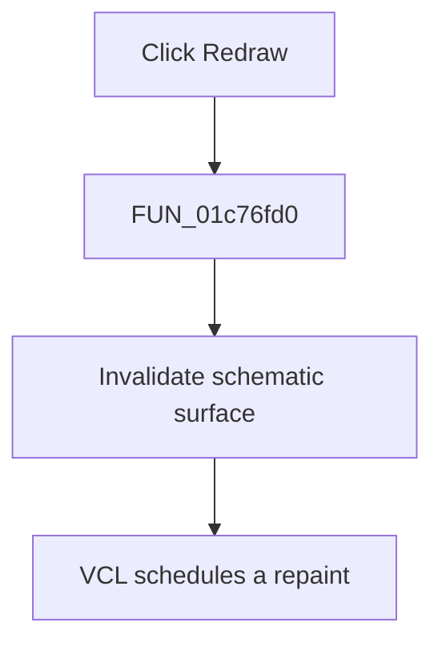

# &Redraw

> Analysis status: Complete. The handler directly invalidates the schematic surface.

## Control

| Property | Recovered value |
| --- | --- |
| Form | SchematicEditor |
| Component path | SchematicEditor.MainMenu.View.mnRedraw |
| Control class | TMenuItem |
| Caption | &Redraw |
| Hint | Not present in the recovered resource. |
| Text | Not present in the recovered resource. |
| Handler name | mnRedrawClick |
| Handler address | 01c76fd0 |
| Graph node | `resource:dfm:SchematicEditor/SchematicEditor.MainMenu.View.mnRedraw` |
| Handler node | `function:01c76fd0` |
| Graph layer | UI |

## What happens when clicked

`FUN_01c76fd0` passes the schematic surface at form offset `0xA10` to `FUN_0064e770`. The recovered VCL helper invokes the control's invalidate method through virtual slot `0x188`. The click does not change schematic data; it requests a repaint of the current view.

## Click flow

## Handler evidence

- Source: [DecompiledSources/Tina16/functions/0000000001C76FD0__FUN_01c76fd0.c](../../../DecompiledSources/Tina16/functions/0000000001C76FD0__FUN_01c76fd0.c)
- Recovered role: Requests a repaint of the schematic surface.
- Current graph summary: Handles 1 Delphi UI event: SchematicEditor.MainMenu.View.mnRedraw.OnClick.
- Current graph behavior: Invalidates the schematic surface so that VCL repaints it.
- Current graph evidence: The handler passes form field `0xA10` to `FUN_0064e770`. The recovered helper invokes the target control's virtual invalidate method at slot `0x188`.
- Complexity: simple
- Distinct outgoing calls: 1

## Direct calls

- `function:0064e770` — FUN_0064e770

## Resource evidence

- Kind: Not present in the recovered resource.
- Modal result: Not present in the recovered resource.
- Checked state: Not present in the recovered resource.
- List items: Not present in the recovered resource.
- Image reference: Not present in the recovered resource.
- Extracted glyph: None.

## Nearby label candidates

Nearby labels are layout candidates only. They are not proof of behavior.

- No same-parent label candidate is available.

## Analysis limits

- The schematic-surface field at offset `0xA10` has no recovered Delphi name.

