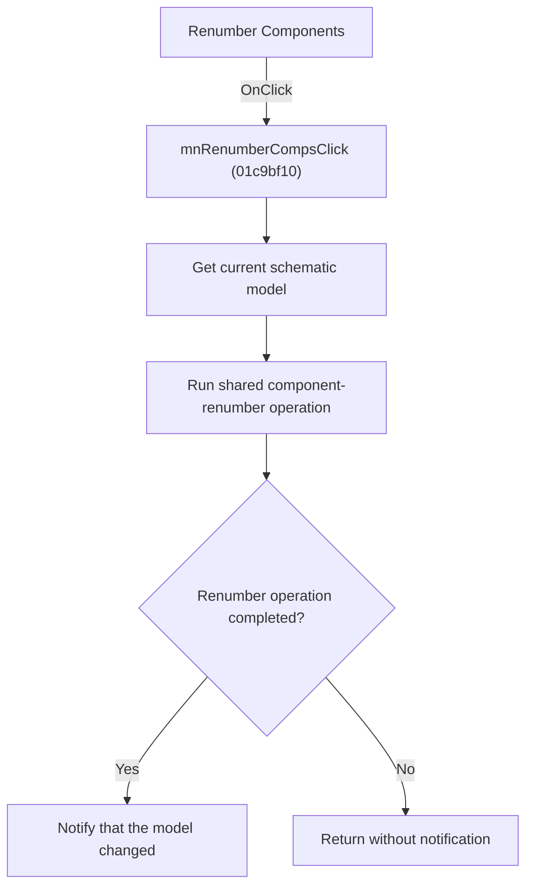

# Renumber Components

> Analysis status: Source, graph, model traversal, and shared-handler evidence reviewed.

## Control

| Property | Recovered value |
| --- | --- |
| Form | SchematicEditor |
| Component path | SchematicEditor.MainMenu.mnTools.mnPCBTools.mnRenumberComps |
| Control class | TMenuItem |
| Caption | Renumber Components |
| Hint | Not present in the recovered resource. |
| Text | Not present in the recovered resource. |
| Handler name | mnRenumberCompsClick |
| Handler address | 01c9bf10 |
| Graph node | `resource:dfm:SchematicEditor/SchematicEditor.MainMenu.mnTools.mnPCBTools.mnRenumberComps` |
| Handler node | `function:01c9bf10` |
| Graph layer | UI |

## What happens when clicked

The command gets the current schematic model and passes it to the shared component-renumber operation. That operation traverses eligible schematic components and runs the renumber user interface. It sends the model-change notification only when its completion flag is set.

The menu handler does not renumber an item directly and does not add a separate refresh step. If there is no current model, the shared path has no model to process.

## Click flow

## Handler evidence

- Source: [DecompiledSources/Tina16/functions/0000000001C9BF10__FUN_01c9bf10.c](../../../DecompiledSources/Tina16/functions/0000000001C9BF10__FUN_01c9bf10.c)
- Recovered role: Runs the shared component-renumber operation for the current schematic model.
- Current graph summary: Passes the current model to `FUN_019acdc0`.
- Current graph behavior: The shared path enumerates eligible components, presents the renumber operation, and reports a model change only after completion.
- Current graph evidence: `FUN_01c9bf10` reads the current model and calls `FUN_019acdc0`. The existing graph annotation for `019acdc0` identifies it as the shared component-renumber operation. Its recovered body traverses component collections, invokes the renumber user interface, and calls the model notification path only when the completion state is true.
- Complexity: simple
- Distinct outgoing calls: 1

## Direct calls

- `function:019acdc0` — FUN_019acdc0

## Resource evidence

- Kind: Not present in the recovered resource.
- Modal result: Not present in the recovered resource.
- Checked state: Not present in the recovered resource.
- List items: Not present in the recovered resource.
- Image reference: Not present in the recovered resource.
- Extracted glyph: None.

## Nearby label candidates

Nearby labels are layout candidates only. They are not proof of behavior.

- No same-parent label candidate is available.

## Analysis limits

- The recovered helper does not expose Delphi names for its temporary component collections.
- The menu handler does not return a success value to the caller.

