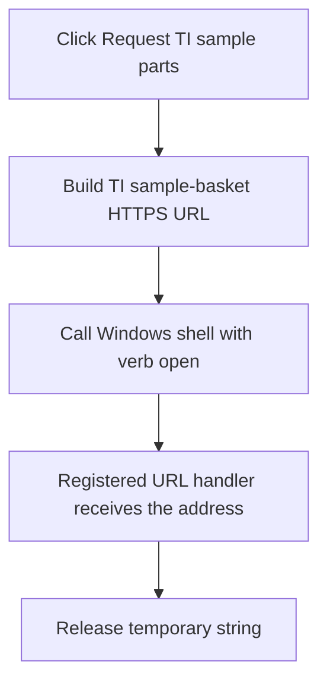

# Request TI sample parts

> Analysis status: Reviewed from the recovered URL and Windows shell invocation.

## Control

| Property | Recovered value |
| --- | --- |
| Form | SchematicEditor |
| Component path | SchematicEditor.MainMenu.mnTIUtilities.mnRequestTISampleParts |
| Control class | TMenuItem |
| Caption | Request TI sample parts |
| Hint | Not present in the recovered resource. |
| Text | Not present in the recovered resource. |
| Handler name | mnRequestTISamplePartsClick |
| Handler address | 01c9d3d0 |
| Graph node | `resource:dfm:SchematicEditor/SchematicEditor.MainMenu.mnTIUtilities.mnRequestTISampleParts` |
| Handler node | `function:01c9d3d0` |
| Graph layer | UI |

## What happens when clicked

The handler constructs the exact URL `https://www-a.ti.com/apps/sampcert/basket.asp` and passes it to the Windows shell with the verb `open` and show mode 1. Windows therefore opens the address with the registered URL handler, normally the default browser. The handler then releases its temporary string.

It does not inspect the shell return value. A missing URL association or browser launch failure produces no local message in this handler.

## Click flow

## Handler evidence

- Source: [DecompiledSources/Tina16/functions/0000000001C9D3D0__FUN_01c9d3d0.c](../../../DecompiledSources/Tina16/functions/0000000001C9D3D0__FUN_01c9d3d0.c)
- Recovered role: Open the TI sample-parts basket URL through the Windows shell.
- Current graph summary: Handles 1 Delphi UI event: SchematicEditor.MainMenu.mnTIUtilities.mnRequestTISampleParts.OnClick.
- Current graph behavior: Opens the literal TI sample-parts URL with the registered Windows URL handler.
- Current graph evidence: `FUN_01c9d3d0` contains the full HTTPS URL and calls the recovered `ShellExecuteW` thunk with `open`, no parameters, no working directory, and show mode 1.
- Complexity: complex
- Distinct outgoing calls: 3

## Direct calls

- `function:00414480` — Delphi UnicodeString clear and finalization helper
- `function:00414b50` — FUN_00414b50
- `function:00416740` — FUN_00416740

## Resource evidence

- Kind: Not present in the recovered resource.
- Modal result: Not present in the recovered resource.
- Checked state: Not present in the recovered resource.
- List items: Not present in the recovered resource.
- Image reference: Not present in the recovered resource.
- Extracted glyph: None.

## Nearby label candidates

Nearby labels are layout candidates only. They are not proof of behavior.

- No same-parent label candidate is available.

## Analysis limits

- This legacy URL can redirect or stop working outside the recovered program. The static source proves only the address passed to Windows.
- The handler ignores the `ShellExecuteW` result.

