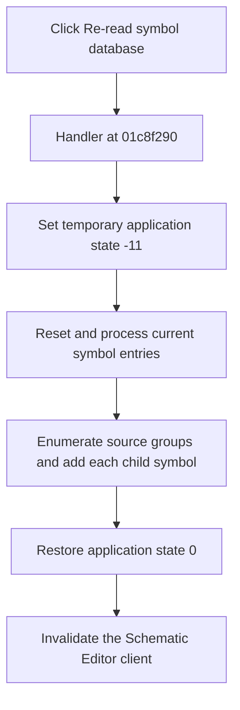

# &Re-read symbol database

> Analysis status: Complete.

## Control

| Property | Recovered value |
| --- | --- |
| Form | SchematicEditor |
| Component path | SchematicEditor.MainMenu.mnTools.mnReReadSymbolDatabase |
| Control class | TMenuItem |
| Caption | &Re-read symbol database |
| Handler | `mnReReadSymbolDatabaseClick` at `01c8f290` |
| Graph nodes | `resource:dfm:SchematicEditor/SchematicEditor.MainMenu.mnTools.mnReReadSymbolDatabase` → `function:01c8f290` |
| Graph layer | UI |

## What happens when clicked

The handler puts the application object into temporary state `-11`. It then calls `FUN_00c40390` on the global symbol manager. That callee runs the manager reset method and processes every current entry. Next, `FUN_00c40160` walks every source group, copies its name, and adds each child symbol to the manager again.

After the rebuild, the handler restores application state `0` and invalidates the Schematic Editor client control at `+0xa10`. Thus, the visible editor redraws against the rebuilt symbol collection.

The recovered path has no user-choice branch, retry, or local exception handler. It does not show a message when the source collection is empty.

## Click flow

## Evidence

- Handler: [FUN_01c8f290](../../../DecompiledSources/Tina16/functions/0000000001C8F290__FUN_01c8f290.c)
- Current-entry reset: [FUN_00c40390](../../../DecompiledSources/Tina16/functions/0000000000C40390__FUN_00c40390.c)
- Collection rebuild: [FUN_00c40160](../../../DecompiledSources/Tina16/functions/0000000000C40160__FUN_00c40160.c)
- Recovered role: Rebuild the global symbol collection and redraw the editor.
- No image or glyph is present for this menu item.

## Analysis limits

- The recovered code does not name the external storage used by the source collection. This article does not claim a file format or database engine.
