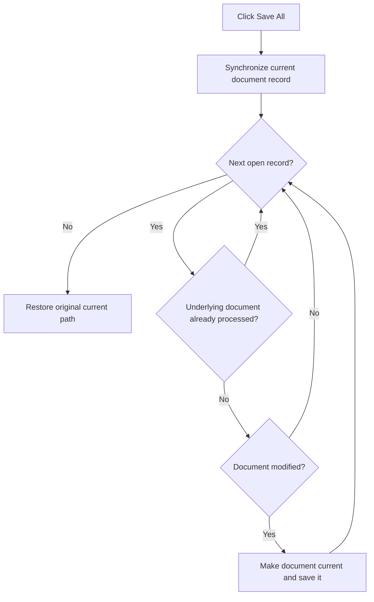

# Sa&ve All

> Analysis status: Reviewed from recovered document enumeration, dirty-state, de-duplication, and save paths.

## Control

| Property | Recovered value |
| --- | --- |
| Form | SchematicEditor |
| Component path | SchematicEditor.MainMenu.mnFile.mnSaveAll |
| Control class | TMenuItem |
| Caption | Sa&ve All |
| Hint | Not present in the recovered resource. |
| Text | Not present in the recovered resource. |
| Handler name | mnSaveAllClick |
| Handler address | 01c945b0 |
| Graph node | `resource:dfm:SchematicEditor/SchematicEditor.MainMenu.mnFile.mnSaveAll` |
| Handler node | `function:01c945b0` |
| Graph layer | UI |

## What happens when clicked

The handler synchronizes the current editor state with its document record. It then enumerates every open document record. A temporary list records each underlying document object that was already processed, so two views of the same document are saved only once.

For each new underlying document, `FUN_01c8cf20` tests whether any associated view is modified. Unmodified documents are skipped. For a modified document, the handler temporarily makes its path and object current and calls the common save routine. After the loop, it restores the original current-document path. With no open or modified documents, the command makes no file write. The handler has no local exception or error-message branch.

## Click flow

## Handler evidence

- Source: [DecompiledSources/Tina16/functions/0000000001C945B0__FUN_01c945b0.c](../../../DecompiledSources/Tina16/functions/0000000001C945B0__FUN_01c945b0.c)
- Recovered role: Save each distinct modified schematic document once.
- Current graph summary: Handles 1 Delphi UI event: SchematicEditor.MainMenu.mnFile.mnSaveAll.OnClick.
- Current graph behavior: Enumerates open records, de-duplicates their underlying document objects, tests modified state, and saves only modified documents.
- Current graph evidence: `FUN_01c945b0` creates a temporary list, uses `FUN_004aeba0` to test membership, adds unseen document objects with `FUN_004ae7e0`, gates the save call on `FUN_01c8cf20`, and restores the original path after enumeration.
- Complexity: complex
- Distinct outgoing calls: 11

## Direct calls

- `function:00410e60` — FUN_00410e60
- `function:00410f20` — Nil-safe Delphi object destruction helper
- `function:00417c40` — FUN_00417c40
- `function:004ae7e0` — FUN_004ae7e0
- `function:004aeac0` — FUN_004aeac0
- `function:004aeba0` — FUN_004aeba0
- `function:014a1f90` — FUN_014a1f90
- `function:0199e310` — FUN_0199e310
- `function:01c8a3c0` — FUN_01c8a3c0
- `function:01c8cf20` — FUN_01c8cf20
- `function:01d0fb00` — FUN_01d0fb00

## Resource evidence

- Kind: Not present in the recovered resource.
- Modal result: Not present in the recovered resource.
- Checked state: Not present in the recovered resource.
- List items: Not present in the recovered resource.
- Image reference: Not present in the recovered resource.
- Extracted glyph: None.

## Nearby label candidates

Nearby labels are layout candidates only. They are not proof of behavior.

- No same-parent label candidate is available.

## Analysis limits

- The common save routine handles the final file format and any Save As interaction. This handler does not expose those details.
- The recovered handler does not aggregate or report save failures locally.

