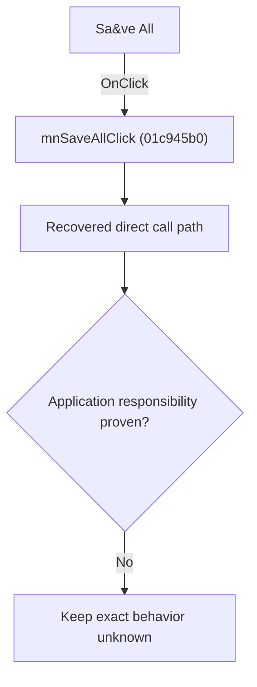

# Sa&ve All

> Analysis status: Blocked by an exact evidence gap.

## Control

| Property | Recovered value |
| --- | --- |
| Form | SchematicEditor |
| Component path | SchematicEditor.MainMenu.mnFile.mnSaveAll |
| Control class | TMenuItem |
| Caption | Sa&ve All |
| Hint | Not present in the recovered resource. |
| Text | Not present in the recovered resource. |
| Handler name | mnSaveAllClick |
| Handler address | 01c945b0 |
| Graph node | `resource:dfm:SchematicEditor/SchematicEditor.MainMenu.mnFile.mnSaveAll` |
| Handler node | `function:01c945b0` |
| Graph layer | UI |

## What happens when clicked

The OnClick binding reaches mnSaveAllClick at 01c945b0. The recovered body has 11 distinct outgoing graph call(s), but the application-specific responsibilities and data effects of its downstream path are not established in the accepted graph evidence. The control's caption or name indicates user intent only; it is not enough to claim implementation behavior.

## Click flow

## Handler evidence

- Source: [DecompiledSources/Tina16/functions/0000000001C945B0__FUN_01c945b0.c](../../../DecompiledSources/Tina16/functions/0000000001C945B0__FUN_01c945b0.c)
- Recovered role: Evidence-blocked mnSaveAllClick command.
- Current graph summary: Handles 1 Delphi UI event: SchematicEditor.MainMenu.mnFile.mnSaveAll.OnClick.
- Current graph behavior: The OnClick binding reaches mnSaveAllClick at 01c945b0. The recovered body has 11 distinct outgoing graph call(s), but the application-specific responsibilities and data effects of its downstream path are not established in the accepted graph evidence. The control's caption or name indicates user intent only; it is not enough to claim implementation behavior.
- Current graph evidence: The DFM binds SchematicEditor.MainMenu.mnFile.mnSaveAll to mnSaveAllClick. The recovered source is DecompiledSources/Tina16/functions/0000000001C945B0__FUN_01c945b0.c and directly references 00410e60, 00410f20, 00417c40, 004ae7e0, 004aeac0, 004aeba0, 014a1f90, 0199e310, and 3 more. No accepted end-to-end role was established for this control path.
- Complexity: complex
- Distinct outgoing calls: 11

## Direct calls

- `function:00410e60` — FUN_00410e60
- `function:00410f20` — Nil-safe Delphi object destruction helper
- `function:00417c40` — FUN_00417c40
- `function:004ae7e0` — FUN_004ae7e0
- `function:004aeac0` — FUN_004aeac0
- `function:004aeba0` — FUN_004aeba0
- `function:014a1f90` — FUN_014a1f90
- `function:0199e310` — FUN_0199e310
- `function:01c8a3c0` — FUN_01c8a3c0
- `function:01c8cf20` — FUN_01c8cf20
- `function:01d0fb00` — FUN_01d0fb00

## Resource evidence

- Kind: Not present in the recovered resource.
- Modal result: Not present in the recovered resource.
- Checked state: Not present in the recovered resource.
- List items: Not present in the recovered resource.
- Image reference: Not present in the recovered resource.
- Extracted glyph: None.

## Nearby label candidates

Nearby labels are layout candidates only. They are not proof of behavior.

- No same-parent label candidate is available.

## Analysis limits

- Exact gap: the recovered handler or one of its direct application callees lacks a source-supported role that proves the command's decisions, state changes, and output. Keep this Bead open until those callees are traced.

