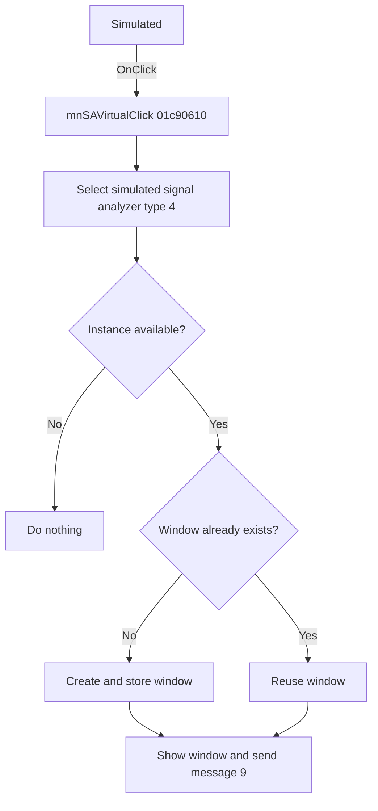

# Simulated

> Analysis status: Reviewed from recovered source and resource evidence.

## Control

| Property | Recovered value |
| --- | --- |
| Form | SchematicEditor |
| Component path | SchematicEditor.MainMenu.mnTM.SignalAnalyzer1.mnSAVirtual |
| Control class | TMenuItem |
| Caption | Simulated |
| Handler | mnSAVirtualClick at `01c90610` |
| Graph node | `resource:dfm:SchematicEditor/SchematicEditor.MainMenu.mnTM.SignalAnalyzer1.mnSAVirtual` |

## What happens when clicked

The click opens or reuses a simulated signal analyzer. The shared handler passes mode `0` and type `4` to `01c8f600`. That coordinator stops when no instance is available. Otherwise, it selects an instance when necessary, reuses or creates the indexed window, adds an instance label to a new caption when applicable, shows the window, and sends native message `9`.

## Click flow

## Handler evidence

- [Handler source](../../../DecompiledSources/Tina16/functions/0000000001C90610__FUN_01c90610.c) calls `FUN_01c8f600(form, 0, 4)`.
- [Coordinator source](../../../DecompiledSources/Tina16/functions/0000000001C8F600__FUN_01c8f600.c) proves the selection, reuse, creation, caption, show, and message paths.
- The parent Signal Analyzer item shares this handler. The Real-time item changes only the mode to `1`.

## Analysis limits

- The recovered source does not identify native message `9` or show a separate modal-cancel test.
