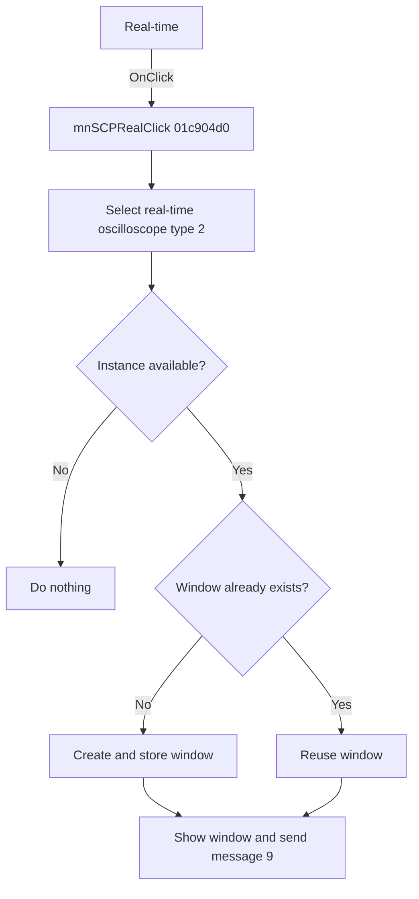

# Real-time

> Analysis status: Reviewed from recovered source and resource evidence.

## Control

| Property | Recovered value |
| --- | --- |
| Form | SchematicEditor |
| Component path | SchematicEditor.MainMenu.mnTM.Oscilloscope1.mnSCPReal |
| Control class | TMenuItem |
| Caption | Real-time |
| Handler | mnSCPRealClick at `01c904d0` |
| Graph node | `resource:dfm:SchematicEditor/SchematicEditor.MainMenu.mnTM.Oscilloscope1.mnSCPReal` |

## What happens when clicked

The click opens or reuses a real-time oscilloscope window. `mnSCPRealClick` passes mode `1` and instrument type `2` to the shared coordinator at `01c8f600`.

The coordinator stops when no oscilloscope instance is available. For multiple instances, it shows a selector and continues only with an in-range index. It reuses the window in that slot or creates and stores a new one. It adds the instance label to a new caption when applicable, shows the window, and sends native message `9`.

## Click flow

## Handler evidence

- [Handler source](../../../DecompiledSources/Tina16/functions/0000000001C904D0__FUN_01c904d0.c) calls `FUN_01c8f600(form, 1, 2)`.
- [Coordinator source](../../../DecompiledSources/Tina16/functions/0000000001C8F600__FUN_01c8f600.c) proves the availability, selection, reuse, creation, caption, show, and message paths.
- The parallel Simulated item changes only the mode to `0` and keeps type `2`.

## Analysis limits

- The recovered source does not identify native message `9` or show a separate modal-cancel test.
