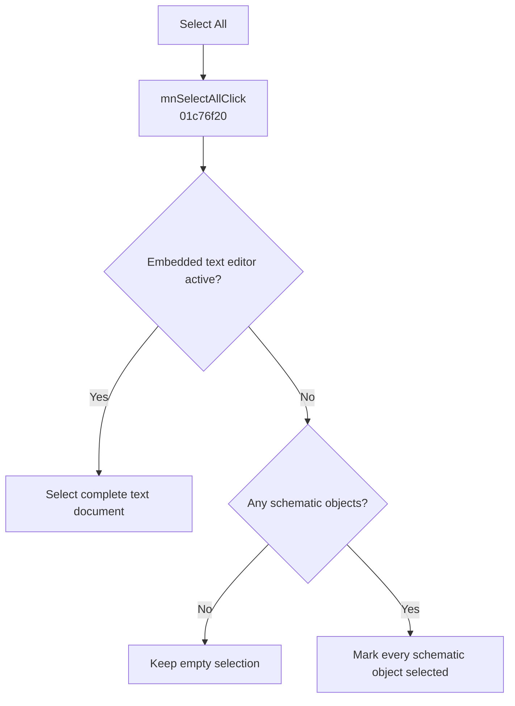

# Select A&ll

> Analysis status: Evidence-backed behavior recovered.

## Control

| Property | Recovered value |
| --- | --- |
| Form | SchematicEditor |
| Component path | SchematicEditor.MainMenu.Edit.mnSelectAll |
| Control class | TMenuItem |
| Caption | Select A&ll |
| Hint | Not present in the recovered resource. |
| Text | Not present in the recovered resource. |
| Handler name | mnSelectAllClick |
| Handler address | 01c76f20 |
| Graph node | `resource:dfm:SchematicEditor/SchematicEditor.MainMenu.Edit.mnSelectAll` |
| Handler node | `function:01c76f20` |
| Graph layer | UI |

## What happens when clicked

The handler selects all content in one of two target modes. For an active embedded text editor with mode value 3 or 4, it calls the recovered SynEdit Select All helper. Otherwise, it reads the schematic object count at model offset `0x10`, enumerates every object, and calls `FUN_01993F30(..., object, 1, 0)` through `FUN_01C76EF0` to select it. An empty model produces no calls and no state change.

## Click flow

## Handler evidence

- Source: [DecompiledSources/Tina16/functions/0000000001C76F20__FUN_01c76f20.c](../../../DecompiledSources/Tina16/functions/0000000001C76F20__FUN_01c76f20.c)
- Recovered role: Selects all text or all schematic objects for the active editor mode.
- Current graph summary: Handles 1 Delphi UI event: SchematicEditor.MainMenu.Edit.mnSelectAll.OnClick.
- Current graph behavior: The text branch selects the complete SynEdit document; the schematic branch enumerates and selects every model object.
- Current graph evidence: `FUN_00BFA390` is the annotated SynEdit Select All helper. `FUN_01C76EF0` forwards each nonnull model object to `FUN_01993F30` with the select flag set to 1.
- Complexity: complex
- Distinct outgoing calls: 3

## Direct calls

- `function:00b94e60` — FUN_00b94e60
- `function:00bfa390` — FUN_00bfa390
- `function:01c76ef0` — FUN_01c76ef0

## Resource evidence

- Kind: Not present in the recovered resource.
- Modal result: Not present in the recovered resource.
- Checked state: Not present in the recovered resource.
- List items: Not present in the recovered resource.
- Image reference: Not present in the recovered resource.
- Extracted glyph: None.

## Nearby label candidates

Nearby labels are layout candidates only. They are not proof of behavior.

- No same-parent label candidate is available.

## Analysis limits

- The handler does not filter object classes. It passes every enumerated model object to the common selection setter.

