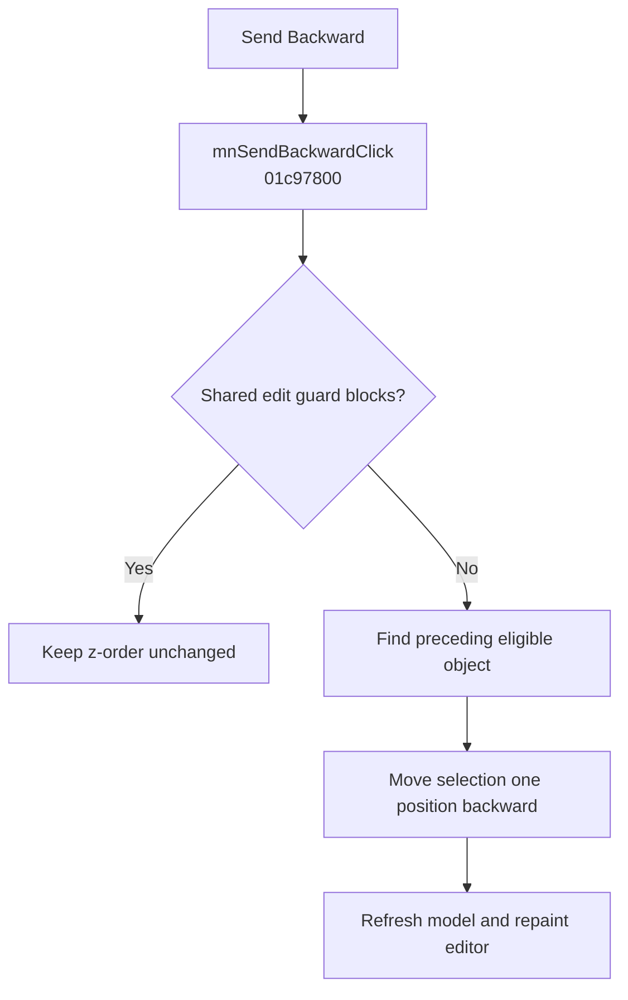

# Send B&ackward

> Analysis status: Evidence-backed behavior recovered.

## Control

| Property | Recovered value |
| --- | --- |
| Form | SchematicEditor |
| Component path | SchematicEditor.MainMenu.Edit.mnArrange.mnSendBackward |
| Control class | TMenuItem |
| Caption | Send B&ackward |
| Hint | Not present in the recovered resource. |
| Text | Not present in the recovered resource. |
| Handler name | mnSendBackwardClick |
| Handler address | 01c97800 |
| Graph node | `resource:dfm:SchematicEditor/SchematicEditor.MainMenu.Edit.mnArrange.mnSendBackward` |
| Handler node | `function:01c97800` |
| Graph layer | UI |

## What happens when clicked

The handler first calls the shared edit guard. If the guard blocks the operation, the click is a no-op. Otherwise, it passes the schematic object list at form offset `0x27A8` to `FUN_019969D0`. That helper finds a selected movable object, finds the preceding eligible object through `FUN_01996370(..., 0)`, and applies the reorder callbacks. The handler then refreshes the model with `(0, 1, 0)` and invalidates the editor control at offset `0xA10`.

This moves the selected schematic object or group one eligible z-order position backward. It makes no change at the back boundary or when editing is blocked.

## Click flow

## Handler evidence

- Source: [DecompiledSources/Tina16/functions/0000000001C97800__FUN_01c97800.c](../../../DecompiledSources/Tina16/functions/0000000001C97800__FUN_01c97800.c)
- Recovered role: Moves the selected schematic objects one z-order position backward.
- Current graph summary: Handles 1 Delphi UI event: SchematicEditor.MainMenu.Edit.mnArrange.mnSendBackward.OnClick.
- Current graph behavior: The handler uses the backward one-step list helper, then refreshes the schematic model and repaints the editor.
- Current graph evidence: `FUN_019969D0` finds the preceding eligible list object through `FUN_01996370(..., 0)` and runs reorder callbacks. The parallel endpoint and forward handlers use different helpers and direction flags.
- Complexity: complex
- Distinct outgoing calls: 4

## Direct calls

- `function:0064e770` — FUN_0064e770
- `function:019969d0` — FUN_019969d0
- `function:0199e310` — FUN_0199e310
- `function:01c8cee0` — FUN_01c8cee0

## Resource evidence

- Kind: Not present in the recovered resource.
- Modal result: Not present in the recovered resource.
- Checked state: Not present in the recovered resource.
- List items: Not present in the recovered resource.
- Image reference: Not present in the recovered resource.
- Extracted glyph: None.

## Nearby label candidates

Nearby labels are layout candidates only. They are not proof of behavior.

- No same-parent label candidate is available.

## Analysis limits

- The recovered source does not expose the displayed z-order number. It does prove the relative one-step move and no-op guards.

