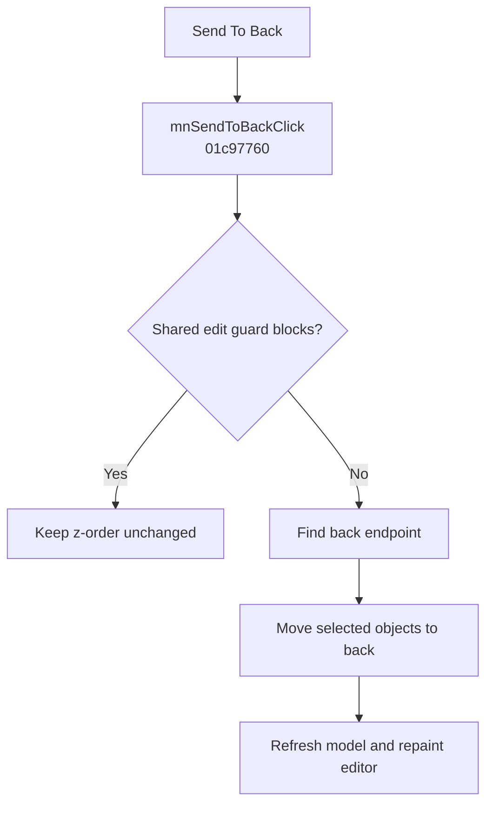

# Send To Back

> Analysis status: Evidence-backed behavior recovered.

## Control

| Property | Recovered value |
| --- | --- |
| Form | SchematicEditor |
| Component path | SchematicEditor.MainMenu.Edit.mnArrange.mnSendToBack |
| Control class | TMenuItem |
| Caption | Send To Back |
| Hint | Not present in the recovered resource. |
| Text | Not present in the recovered resource. |
| Handler name | mnSendToBackClick |
| Handler address | 01c97760 |
| Graph node | `resource:dfm:SchematicEditor/SchematicEditor.MainMenu.Edit.mnArrange.mnSendToBack` |
| Handler node | `function:01c97760` |
| Graph layer | UI |

## What happens when clicked

The handler first calls the shared edit guard. If the guard blocks the operation, the click is a no-op. Otherwise, it calls `FUN_019966C0` for the schematic object list at form offset `0x27A8`. That helper locates the back endpoint, iterates the list from the start, and applies its reorder callback to selected movable objects. The handler then refreshes the model with `(0, 1, 0)` and invalidates the editor control at offset `0xA10`.

This moves selected schematic objects to the back endpoint while it preserves their internal order. An empty selection, an ineligible selection, or a blocked edit state makes no z-order change.

## Click flow

## Handler evidence

- Source: [DecompiledSources/Tina16/functions/0000000001C97760__FUN_01c97760.c](../../../DecompiledSources/Tina16/functions/0000000001C97760__FUN_01c97760.c)
- Recovered role: Moves selected schematic objects to the back z-order endpoint.
- Current graph summary: Handles 1 Delphi UI event: SchematicEditor.MainMenu.Edit.mnArrange.mnSendToBack.OnClick.
- Current graph behavior: The handler applies the back-endpoint list reorder, then refreshes the schematic model and repaints the editor.
- Current graph evidence: `FUN_019966C0` selects the back endpoint and iterates selected movable objects from the start of the list. The one-step backward handler instead uses `FUN_019969D0`.
- Complexity: complex
- Distinct outgoing calls: 4

## Direct calls

- `function:0064e770` — FUN_0064e770
- `function:019966c0` — FUN_019966c0
- `function:0199e310` — FUN_0199e310
- `function:01c8cee0` — FUN_01c8cee0

## Resource evidence

- Kind: Not present in the recovered resource.
- Modal result: Not present in the recovered resource.
- Checked state: Not present in the recovered resource.
- List items: Not present in the recovered resource.
- Image reference: Not present in the recovered resource.
- Extracted glyph: None.

## Nearby label candidates

Nearby labels are layout candidates only. They are not proof of behavior.

- No same-parent label candidate is available.

## Analysis limits

- The recovered source does not expose the displayed z-order number. It does prove the endpoint move and no-op guards.

