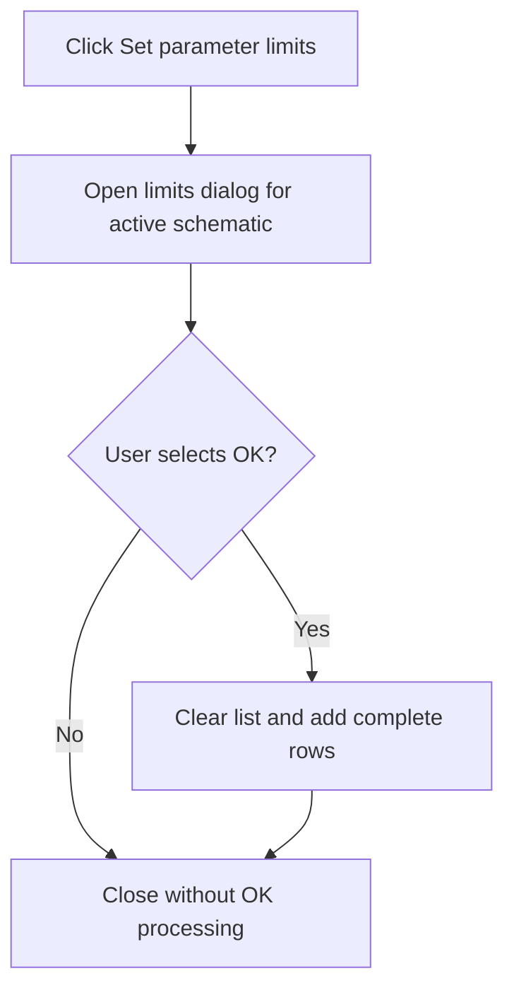

# Set parameter limits...

> Analysis status: Reviewed from the parameter-limit dialog and OK handler.

## Control

| Property | Recovered value |
| --- | --- |
| Form | SchematicEditor |
| Component path | SchematicEditor.MainMenu.mnAnalysis.mnSetCompValueLimits |
| Control class | TMenuItem |
| Caption | Set parameter limits... |
| Hint | Not present in the recovered resource. |
| Text | Not present in the recovered resource. |
| Handler name | mnSetCompValueLimitsClick |
| Handler address | 01ca3b10 |
| Graph node | `resource:dfm:SchematicEditor/SchematicEditor.MainMenu.mnAnalysis.mnSetCompValueLimits` |
| Handler node | `function:01ca3b10` |
| Graph layer | UI |

## What happens when clicked

The handler opens `frmSetCompMainValueLimits` for the active schematic and waits for the dialog to close. The dialog displays component, minimum, and maximum columns. When the user selects OK, its recovered handler clears the attached limit list and adds only rows in which all three cells contain text. It does not validate that the minimum and maximum text is numeric. The menu handler destroys the dialog after it closes.

## Click flow

## Handler evidence

- Source: [DecompiledSources/Tina16/functions/0000000001CA3B10__FUN_01ca3b10.c](../../../DecompiledSources/Tina16/functions/0000000001CA3B10__FUN_01ca3b10.c)
- Recovered role: Open the component main-value limit editor for the active schematic.
- Current graph summary: Handles 1 Delphi UI event: SchematicEditor.MainMenu.mnAnalysis.mnSetCompValueLimits.OnClick.
- Current graph behavior: Shows the component-limit editor for the active schematic. The dialog OK path rebuilds the attached limit list from complete grid rows.
- Current graph evidence: `FUN_01ca3b10` passes the active schematic field at `+0x2788` to the `frmSetCompMainValueLimits` constructor at `01c480a0`, shows the form modally, and destroys it. The separately recovered `OKBtn` handler at `01c48530` clears the list at nested offset `+0x448`, trims grid columns 0 through 2, and appends a row only when all three values are nonempty.
- Complexity: moderate
- Distinct outgoing calls: 2

## Direct calls

- `function:00410f20` — Nil-safe Delphi object destruction helper
- `function:01c480a0` — FUN_01c480a0

## Resource evidence

- Kind: Not present in the recovered resource.
- Modal result: Not present in the recovered resource.
- Checked state: Not present in the recovered resource.
- List items: Not present in the recovered resource.
- Image reference: Not present in the recovered resource.
- Extracted glyph: None.

## Nearby label candidates

Nearby labels are layout candidates only. They are not proof of behavior.

- No same-parent label candidate is available.

## Analysis limits

- The menu handler does not inspect the modal result. The dialog's OK handler owns the list update.
- Numeric range validation is not present in the recovered OK path.

