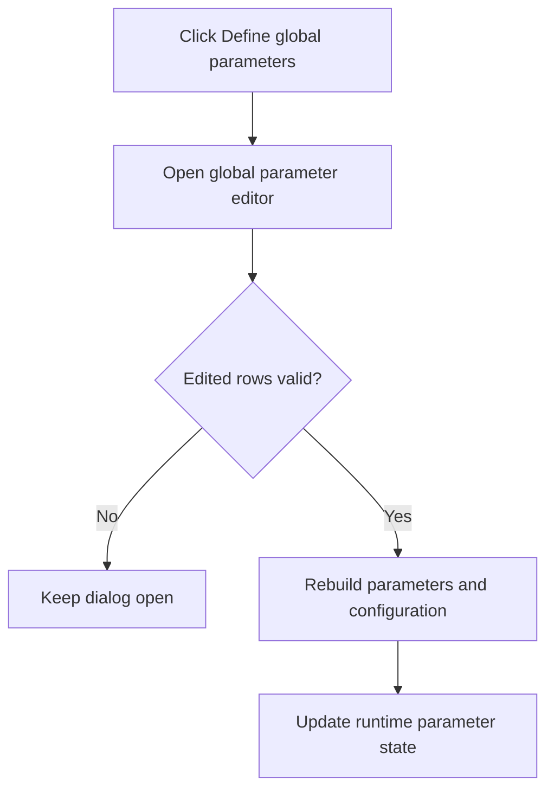

# Define global parameters...

> Analysis status: Reviewed from the global-parameter editor and commit handler.

## Control

| Property | Recovered value |
| --- | --- |
| Form | SchematicEditor |
| Component path | SchematicEditor.MainMenu.mnAnalysis.mnSetGlobalParameters |
| Control class | TMenuItem |
| Caption | Define global parameters... |
| Hint | Not present in the recovered resource. |
| Text | Not present in the recovered resource. |
| Handler name | mnSetGlobalParametersClick |
| Handler address | 01ca3b60 |
| Graph node | `resource:dfm:SchematicEditor/SchematicEditor.MainMenu.mnAnalysis.mnSetGlobalParameters` |
| Handler node | `function:01ca3b60` |
| Graph layer | UI |

## What happens when clicked

The handler creates `frmParamEditor` with the active schematic's global parameter and configuration data. It then shows the dialog modally and destroys it. The dialog OK handler validates all editable rows. A validation failure keeps the dialog open. A successful OK rebuilds the parameter assignments and configuration block, updates the attached parameter objects, transfers the edited list to runtime state, and recalculates derived global values.

## Click flow

## Handler evidence

- Source: [DecompiledSources/Tina16/functions/0000000001CA3B60__FUN_01ca3b60.c](../../../DecompiledSources/Tina16/functions/0000000001CA3B60__FUN_01ca3b60.c)
- Recovered role: Open the global parameter editor for the active schematic.
- Current graph summary: Handles 1 Delphi UI event: SchematicEditor.MainMenu.mnAnalysis.mnSetGlobalParameters.OnClick.
- Current graph behavior: Shows the global parameter editor with active schematic data. The dialog OK path validates and commits the edited parameter set to runtime state.
- Current graph evidence: `FUN_01ca3b60` takes lists from active-document fields `+0x27a8` and `+0x2788`, passes them to the `frmParamEditor` constructor at `0143a6e0`, shows the dialog, and destroys it. The annotated `btnOK` handler at `0143b640` validates rows, rebuilds assignments and the configuration block, replaces the runtime list, and recalculates derived state.
- Complexity: moderate
- Distinct outgoing calls: 2

## Direct calls

- `function:00410f20` — Nil-safe Delphi object destruction helper
- `function:0143a6e0` — FUN_0143a6e0

## Resource evidence

- Kind: Not present in the recovered resource.
- Modal result: Not present in the recovered resource.
- Checked state: Not present in the recovered resource.
- List items: Not present in the recovered resource.
- Image reference: Not present in the recovered resource.
- Extracted glyph: None.

## Nearby label candidates

Nearby labels are layout candidates only. They are not proof of behavior.

- No same-parent label candidate is available.

## Analysis limits

- The menu handler does not inspect the modal result. The dialog's OK handler owns validation and commit.

