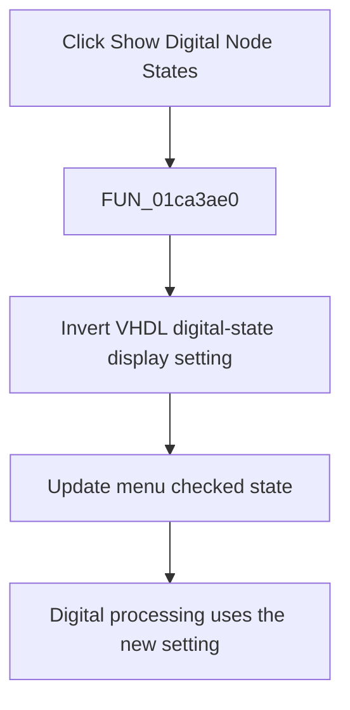

# Show Digital Node States

> Analysis status: Complete. The VHDL setting, menu check, and state consumers establish the toggle.

## Control

| Property | Recovered value |
| --- | --- |
| Form | SchematicEditor |
| Component path | SchematicEditor.MainMenu.View.mnShowDigitalNodeStates |
| Control class | TMenuItem |
| Caption | Show Digital Node States |
| Hint | Not present in the recovered resource. |
| Text | Not present in the recovered resource. |
| Handler name | mnShowDigitalNodeStatesClick |
| Handler address | 01ca3ae0 |
| Graph node | `resource:dfm:SchematicEditor/SchematicEditor.MainMenu.View.mnShowDigitalNodeStates` |
| Handler node | `function:01ca3ae0` |
| Graph layer | UI |

## What happens when clicked

`FUN_01ca3ae0` inverts `PTR_DAT_020030c0[5]` and applies the new value to the checked state of `mnShowDigitalNodeStates`. The settings writer stores the same byte as `Vhdl/Display digital node states`, and analysis-context builders copy it into their digital-display state. The handler does not invalidate the schematic surface directly; later digital-state processing consumes the new setting.

## Click flow

## Handler evidence

- Source: [DecompiledSources/Tina16/functions/0000000001CA3AE0__FUN_01ca3ae0.c](../../../DecompiledSources/Tina16/functions/0000000001CA3AE0__FUN_01ca3ae0.c)
- Recovered role: Toggles the VHDL digital-node-state display setting and menu check.
- Current graph summary: Handles 1 Delphi UI event: SchematicEditor.MainMenu.View.mnShowDigitalNodeStates.OnClick.
- Current graph behavior: Inverts the recovered VHDL digital-state display byte and updates this menu item's checked state.
- Current graph evidence: The handler toggles `PTR_DAT_020030c0[5]` and passes it to `TMenuItem.SetChecked` for form field `0x15F8`. `FUN_01c85f70` stores the byte under `Vhdl/Display digital node states`; `FUN_00f85050`, `FUN_010828f0`, `FUN_014f1700`, and `FUN_01b06050` consume it.
- Complexity: simple
- Distinct outgoing calls: 1

## Direct calls

- `function:007e2d20` — FUN_007e2d20

## Resource evidence

- Kind: Not present in the recovered resource.
- Modal result: Not present in the recovered resource.
- Checked state: Not present in the recovered resource.
- List items: Not present in the recovered resource.
- Image reference: Not present in the recovered resource.
- Extracted glyph: None.

## Nearby label candidates

Nearby labels are layout candidates only. They are not proof of behavior.

- No same-parent label candidate is available.

## Analysis limits

- The handler does not request an immediate repaint. The exact time at which each consumer redraws a node state is outside this click wrapper.

