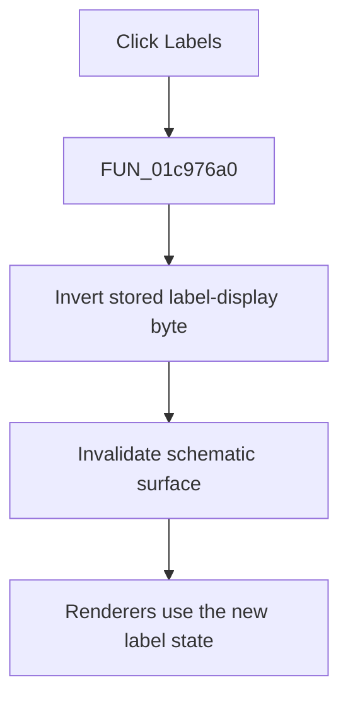

# &Labels

> Analysis status: Complete. The stored display setting, menu synchronization, and renderer readers establish the toggle.

## Control

| Property | Recovered value |
| --- | --- |
| Form | SchematicEditor |
| Component path | SchematicEditor.MainMenu.View.mnShowLabels |
| Control class | TMenuItem |
| Caption | &Labels |
| Hint | Not present in the recovered resource. |
| Text | Not present in the recovered resource. |
| Handler name | mnShowLabelsClick |
| Handler address | 01c976a0 |
| Graph node | `resource:dfm:SchematicEditor/SchematicEditor.MainMenu.View.mnShowLabels` |
| Handler node | `function:01c976a0` |
| Graph layer | UI |

## What happens when clicked

`FUN_01c976a0` inverts the label-display byte at `PTR_DAT_02004010[0x816]` and invalidates the schematic surface at form offset `0xA10`. The settings writer stores this state as `Schematic Editor/ShowLabels`. The menu-update routine uses the inverse byte value for the `mnShowLabels` check, and multiple render and model routines read the same byte. Thus, the click changes label visibility and schedules a repaint.

## Click flow

## Handler evidence

- Source: [DecompiledSources/Tina16/functions/0000000001C976A0__FUN_01c976a0.c](../../../DecompiledSources/Tina16/functions/0000000001C976A0__FUN_01c976a0.c)
- Recovered role: Toggles schematic label visibility and repaints the surface.
- Current graph summary: Handles 1 Delphi UI event: SchematicEditor.MainMenu.View.mnShowLabels.OnClick.
- Current graph behavior: Inverts the stored label-display state and invalidates the schematic surface.
- Current graph evidence: The handler toggles `PTR_DAT_02004010[0x816]` and calls the invalidate helper. `FUN_01c85f70` stores the state as `ShowLabels`; `FUN_01c7ec30` synchronizes the menu check; renderer entry `FUN_0198e380` and other model routines read the same byte.
- Complexity: simple
- Distinct outgoing calls: 1

## Direct calls

- `function:0064e770` — FUN_0064e770

## Resource evidence

- Kind: Not present in the recovered resource.
- Modal result: Not present in the recovered resource.
- Checked state: true
- List items: Not present in the recovered resource.
- Image reference: Not present in the recovered resource.
- Extracted glyph: None.

## Nearby label candidates

Nearby labels are layout candidates only. They are not proof of behavior.

- No same-parent label candidate is available.

## Analysis limits

- The recovered byte uses inverse logic for the menu check, so its internal true/false name is unknown.

