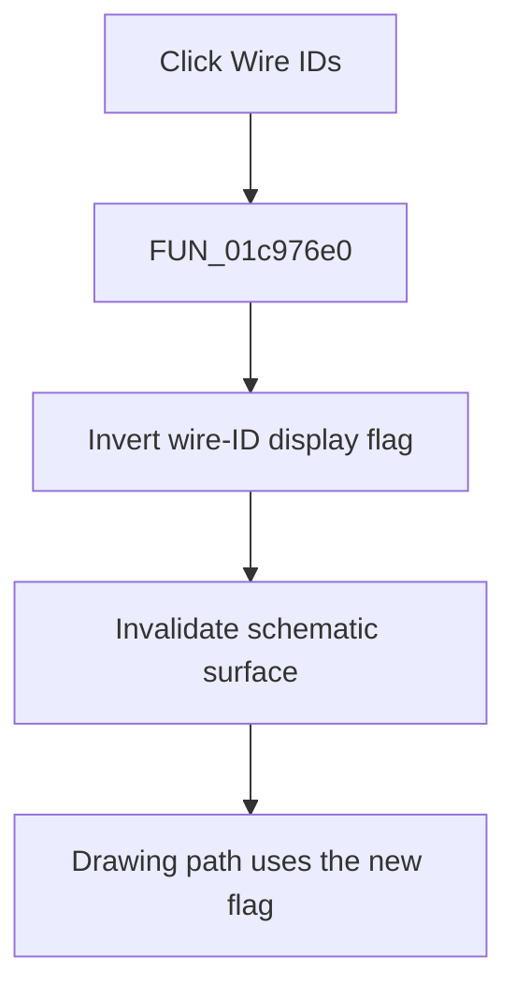

# Wire IDs

> Analysis status: Complete. The display flag reader, menu synchronization, and repaint call establish the toggle.

## Control

| Property | Recovered value |
| --- | --- |
| Form | SchematicEditor |
| Component path | SchematicEditor.MainMenu.View.mnShowWireIDs |
| Control class | TMenuItem |
| Caption | Wire IDs |
| Hint | Not present in the recovered resource. |
| Text | Not present in the recovered resource. |
| Handler name | mnShowWireIDsClick |
| Handler address | 01c976e0 |
| Graph node | `resource:dfm:SchematicEditor/SchematicEditor.MainMenu.View.mnShowWireIDs` |
| Handler node | `function:01c976e0` |
| Graph layer | UI |

## What happens when clicked

`FUN_01c976e0` inverts the global wire-ID display byte at `PTR_DAT_02001ca0` and invalidates the schematic surface at form offset `0xA10`. The menu-update routine copies the byte to this menu item's checked state. Drawing routine `FUN_017c1520` also reads the byte in the branch that emits wire-related text. Thus, the click turns wire IDs on or off and schedules a repaint.

## Click flow

## Handler evidence

- Source: [DecompiledSources/Tina16/functions/0000000001C976E0__FUN_01c976e0.c](../../../DecompiledSources/Tina16/functions/0000000001C976E0__FUN_01c976e0.c)
- Recovered role: Toggles wire-ID display and repaints the schematic surface.
- Current graph summary: Handles 1 Delphi UI event: SchematicEditor.MainMenu.View.mnShowWireIDs.OnClick.
- Current graph behavior: Inverts the shared wire-ID display byte and invalidates the schematic surface.
- Current graph evidence: The handler toggles `PTR_DAT_02001ca0` and calls the invalidate helper. `FUN_01c7ec30` uses the byte as this menu item's checked state, and `FUN_017c1520` reads it in a wire-text drawing branch.
- Complexity: simple
- Distinct outgoing calls: 1

## Direct calls

- `function:0064e770` — FUN_0064e770

## Resource evidence

- Kind: Not present in the recovered resource.
- Modal result: Not present in the recovered resource.
- Checked state: Not present in the recovered resource.
- List items: Not present in the recovered resource.
- Image reference: Not present in the recovered resource.
- Extracted glyph: None.

## Nearby label candidates

Nearby labels are layout candidates only. They are not proof of behavior.

- No same-parent label candidate is available.

## Analysis limits

- The global display byte has no recovered Delphi field name.

