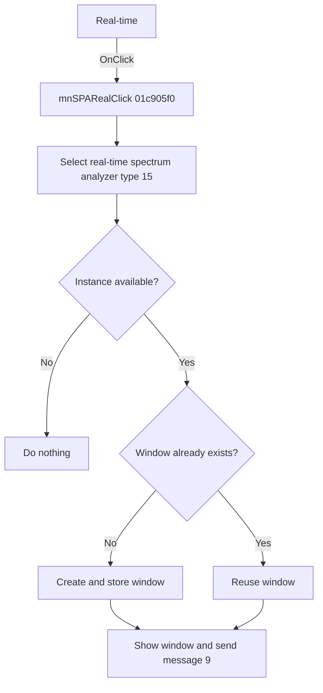

# Real-time

> Analysis status: Reviewed from recovered source and resource evidence.

## Control

| Property | Recovered value |
| --- | --- |
| Form | SchematicEditor |
| Component path | SchematicEditor.MainMenu.mnTM.SpectrumAnalyzer1.mnSPAReal |
| Control class | TMenuItem |
| Caption | Real-time |
| Handler | mnSPARealClick at `01c905f0` |
| Graph node | `resource:dfm:SchematicEditor/SchematicEditor.MainMenu.mnTM.SpectrumAnalyzer1.mnSPAReal` |

## What happens when clicked

The click opens or reuses a real-time spectrum analyzer. The handler passes mode `1` and type `15` to `01c8f600`. The coordinator stops when no instance is available. Otherwise, it selects an instance when necessary, reuses or creates the indexed window, adds an instance label to a new caption when applicable, shows it, and sends native message `9`.

## Click flow

## Handler evidence

- [Handler source](../../../DecompiledSources/Tina16/functions/0000000001C905F0__FUN_01c905f0.c) calls `FUN_01c8f600(form, 1, 15)`.
- [Coordinator source](../../../DecompiledSources/Tina16/functions/0000000001C8F600__FUN_01c8f600.c) proves the selection, reuse, creation, caption, show, and message paths.
- The simulated spectrum analyzer controls change only the mode to `0`.

## Analysis limits

- The recovered source does not identify native message `9` or show a separate modal-cancel test.
